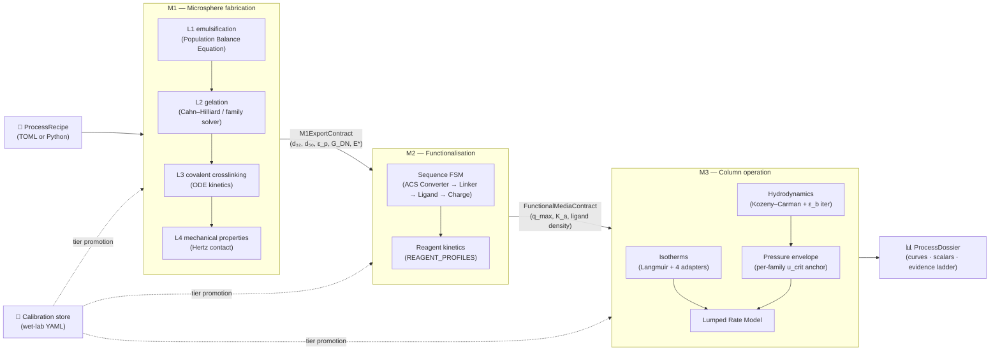
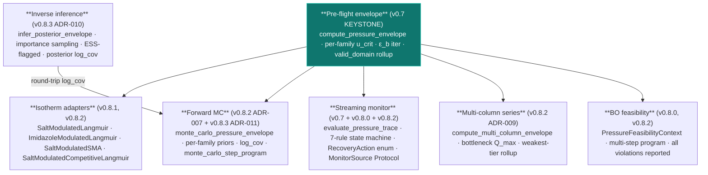
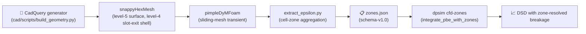
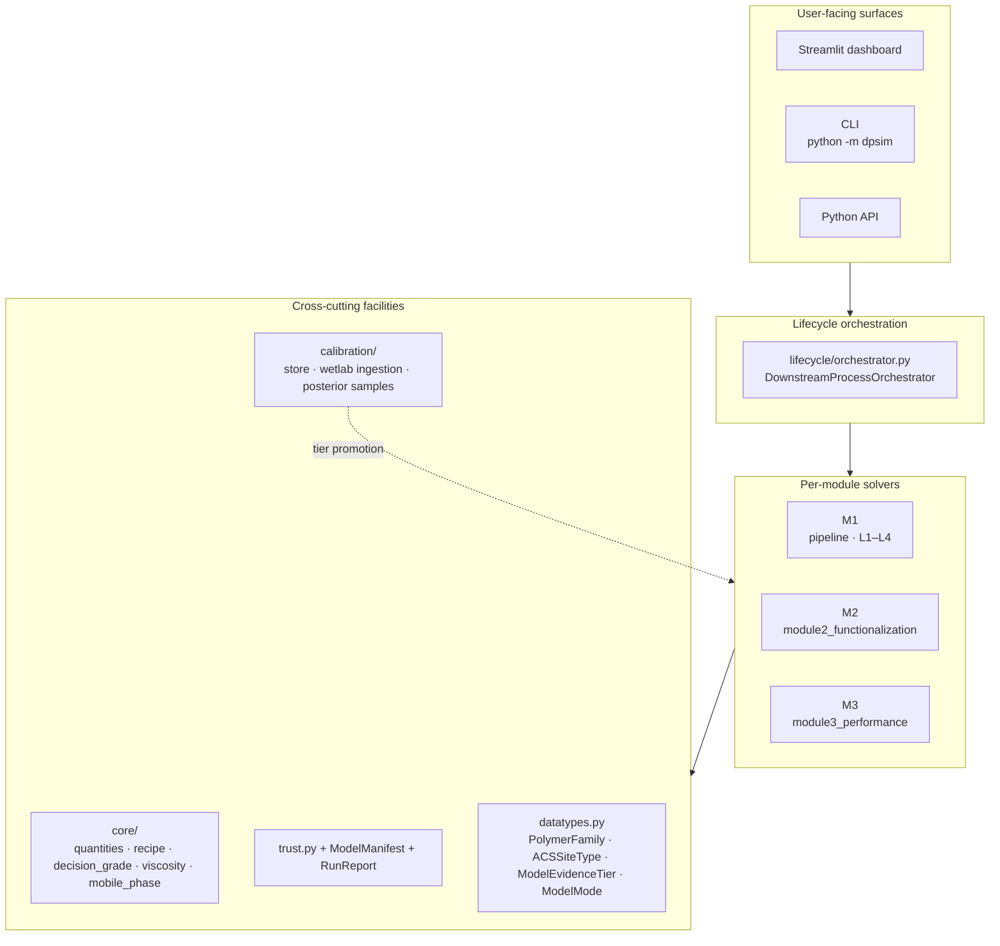

# DPSim

[](LICENSE)
[](docs/decisions/ADR-001-python-version-policy.md)
[](CHANGELOG.md)
[](https://github.com/tocvicmeng-prog/Downstream-Processing-Simulator/releases/latest)
[](docs/decisions/)
[](tests/)

> A research-grade screening simulator for the full polysaccharide-microsphere lifecycle — from emulsification, through ligand functionalisation, through affinity-column operation — with **physics-anchored** pressure envelopes, **evidence-graded** numeric outputs, and **Bayesian** forward and inverse uncertainty propagation.

---

## What this README will give you

If you read it from top to bottom you will leave with:

1. A clear sense of **what problem DPSim solves** and the boundary of where it stops being useful.
2. A working understanding of the **three-module lifecycle** (M1 fabrication, M2 functionalisation, M3 column operation) and the data contracts between them.
3. The single most important behavioural rule of the simulator: **every number carries an evidence tier**, and the renderer enforces honesty about that tier.
4. The shape of the v0.7 → v0.8.3 **pressure-envelope and uncertainty propagation** stack — the largest body of work in the current release line.
5. The **install procedure** for end-users (Win11 installer, portable ZIP) and the **source-install** procedure for developers.
6. The **architecture, philosophy, and ADR trail** that explains why the codebase is shaped the way it is.
7. The **limits, hazards, and wet-lab handshake** that bound legitimate use of any DPSim result.
8. The **IP and licensing posture** — a GPL-3.0 distribution of Holocyte Pty Ltd's intellectual property, with the inventive contributions disclosed at the level appropriate for an open-source release.

A new user trying to decide whether DPSim fits their workflow should be able to make that call after the first three sections (about five minutes of reading). Technical readers will want the architecture, repository, and ADR sections. Wet-lab and process-engineering collaborators should jump to the pressure-envelope, calibration, and limitations sections.

---

## Table of contents

1. [Why DPSim exists](#1-why-dpsim-exists)
2. [The three-module lifecycle](#2-the-three-module-lifecycle)
3. [Evidence tiers — read this before any number](#3-evidence-tiers--read-this-before-any-number)
4. [Microsphere fabrication pathways](#4-microsphere-fabrication-pathways)
5. [The pressure-envelope and uncertainty stack (v0.7 → v0.8.3)](#5-the-pressure-envelope-and-uncertainty-stack-v07--v083)
6. [Hardware geometries and CFD–PBE coupling](#6-hardware-geometries-and-cfd-pbe-coupling)
7. [Installation and configuration](#7-installation-and-configuration)
8. [System requirements and dependencies](#8-system-requirements-and-dependencies)
9. [Quickstart](#9-quickstart)
10. [System architecture and operating principles](#10-system-architecture-and-operating-principles)
11. [Repository layout](#11-repository-layout)
12. [Numerical solver matrix](#12-numerical-solver-matrix)
13. [Development philosophy and design rationale](#13-development-philosophy-and-design-rationale)
14. [Usage considerations, limitations, and best practices](#14-usage-considerations-limitations-and-best-practices)
15. [Document map — how to navigate the project](#15-document-map--how-to-navigate-the-project)
16. [Version history and architectural milestones](#16-version-history-and-architectural-milestones)
17. [Intellectual property, patents, and licensing](#17-intellectual-property-patents-and-licensing)
18. [Citation](#18-citation)
19. [Contributing and support](#19-contributing-and-support)
20. [Disclaimer](#20-disclaimer)

---

## 1. Why DPSim exists

Designing a polysaccharide-microsphere affinity medium requires decisions across three coupled disciplines: rheology and fluid mechanics during emulsification, organic chemistry during functionalisation, and packed-bed transport during column operation. A single end-to-end bench iteration consumes reagents, instrument time, and operator effort measured in days. Most of those days end up consumed by candidates that a simple physics check would have rejected up-front — a bead too soft for the operating flow rate, a chemistry sequence that violates a coupling-window precondition, an isotherm regime that the literature already places out-of-domain.

DPSim collapses that loop. A written recipe — polymer family, hardware mode, fabrication conditions, functionalisation steps, column geometry, mobile-phase composition, gradient program — flows through a chain of physical-chemistry models and emerges as a structured prediction: bead size distribution, mechanical modulus, ligand density, breakthrough capacity, dynamic binding capacity, recovery, and a pre-flight back-pressure envelope. Each scalar output carries an evidence tier, an uncertainty interval, the validation gates it cleared, and the calibration data it would need to claim more confidence.

Two design constraints shape every part of the system:

**Honesty about uncertainty.** A simulator that confidently reports the wrong number is more dangerous than no simulator at all. DPSim's render policy refuses to display a value as a point estimate when its evidence does not support point-estimate precision; the value renders as an interval, a rank band, or is suppressed entirely. The decision is automatic, audited, and surfaced to the user at every numeric site.

**Tier inheritance.** A downstream prediction cannot claim more confidence than its weakest upstream input. If the M1 mechanical modulus is `qualitative_trend`, every M3 metric that consumes it is capped at `qualitative_trend`. The rule is enforced at every boundary in the pipeline.

What DPSim is *not* — emphatically — is a regulatory submission, a GMP batch record, or a substitute for the wet-lab calibration cycle. Its contribution is to narrow the parameter space cheaply and surface failure modes early, not to replace bench validation.

---

## 2. The three-module lifecycle

DPSim is a **lifecycle** simulator. The user authors one recipe; the simulator threads it through three sequential modules whose outputs feed strictly downstream. Each module owns a typed export contract that crosses the boundary to the next module unchanged once produced.



### M1 — Microsphere fabrication

The fabrication module models four nested levels (L1 → L4). Hot or cold polymer solution is dispersed as droplets into an immiscible continuous phase (L1, governed by a population balance equation describing breakage and coalescence under the local turbulence field). Droplets gel through the family-specific mechanism — thermal helix-coil for agarose, ionotropic for alginate, non-solvent-induced phase separation for cellulose, solvent evaporation for PLGA (L2). A covalent secondary network may then lock the structure (L3). The resulting microspheres carry a predicted mechanical envelope — shear modulus, effective Young's modulus, and the bead diameters d₁₀ / d₃₂ / d₅₀ / d₉₀ that downstream chromatography needs (L4).

The output crosses the boundary as the **M1 export contract**: a frozen, typed bundle of bead-distribution moments, pore architecture, mechanical fields, and residual oil/surfactant after wash. Crucially, the contract carries d₃₂ (Sauter mean — surface-area-equivalent), not d₅₀, since Kozeny–Carman and the column hydrodynamics that consume it derive from a surface-area-weighted diameter. This was the second-of-three corrections in the v0.7.0 M3 rebuild.

### M2 — Functionalisation

Functionalisation transforms a bare microsphere matrix into an affinity medium through a chemistry sequence. The sequence is constrained by a finite-state machine: ACS converter (CNBr, CDI, tresyl, cyanuric, glyoxyl, periodate, ECH, DVS) → optional linker arm (pyridyl-disulfide, spacer) → ligand coupling (Protein A/G/L, IEX, HIC, IMAC, click, GST, heparin) → optional ion charging or quench. Reagents from a 103-entry library (`REAGENT_PROFILES`) carry their kinetic parameters, hazard class, and reproducibility caveats. The simulator tracks 26 surface-chemistry site types through the M2 ACS state vector; sites are consumed and produced as each step runs.

The output crosses the boundary as the **functional media contract**: ligand density, accessible surface area on which that density was computed, an estimated maximum binding capacity, an affinity-binding hint for M3 isotherm selection, and a model manifest carrying the upstream evidence tier and any leaching, free-protein, or activity-retention caveats.

### M3 — Column operation

Column operation is where the v0.7.0 → v0.8.3 patch cluster did most of its work. Before the recipe runs the chromatography solver, the **pre-flight pressure envelope** computes the operational ceiling for the column-resin-buffer combination: the critical superficial velocity u_crit, the corresponding maximum volumetric flow rate Q_max, the operational ΔP ceiling, the headroom ratio at the recipe's flow setpoint, the structural bursting ceiling reported separately as a diagnostic, and the decision tier that walks the family's valid-domain constraints. The envelope rolls forward into a pre-flight UI panel and into the BO feasibility filter for upstream parameter optimisation.

The chromatography solver itself is a Lumped Rate Model with axial dispersion, film mass transfer, and one of several isotherms — single-component Langmuir for screening, Mollerup-simplified salt-modulated Langmuir for IEX, imidazole-modulated Langmuir for IMAC, full Steric Mass Action when σ has been fitted, or competitive Langmuir for multi-component co-elution. Optional layers wrap the deterministic solver: a forward Monte Carlo path producing P05/P50/P95 envelope bands and a `p_blocker` tail probability, and an inverse path that takes measured (Q, ΔP) pairs and importance-samples a posterior over the key parameters.

The output crosses the boundary as a `ProcessDossier` — a structured artefact carrying every curve, every scalar, and the evidence ladder that bounds each one.

---

## 3. Evidence tiers — read this before any number

DPSim's most distinctive behaviour is its refusal to display a number more confidently than the underlying evidence supports. Every model output carries one of five tiers, and the renderer translates the tier into a display mode automatically.

### The five tiers

| Tier | What it means | Operational implication |
|---|---|---|
| `validated_quantitative` | Calibrated against this specific system *and* validated against an independent held-out dataset | Suitable for design within the validated domain |
| `calibrated_local` | Fitted to local wet-lab data; not yet broadly cross-validated | Suitable for screening and local interpolation |
| `semi_quantitative` | Literature-parameterised or mechanistically plausible | Trends are useful; magnitudes are approximate |
| `qualitative_trend` | Directional or ranking-only | Hypothesis generation only |
| `unsupported` | Chemistry, unit, regime, or operation not represented in the model | **Do not use for decisions** |

### Inheritance

Tier flows downhill. The strongest claim a downstream module can make is the weakest claim made by its upstream inputs. The rule is enforced in `RunReport.compute_min_tier`; the dashboard surfaces it on every result panel; the dossier export records it for every scalar.


### The render-mode policy

Each output type has a policy floor — the minimum tier at which a point-estimate display is honest. The renderer compares the actual tier to that floor and chooses one of four display modes:

| Tier vs. policy floor | Display mode | Example |
|---|---|---|
| At or above floor | `NUMBER` | `DBC₁₀ = 42.3 mol/m³` |
| One tier below floor | `INTERVAL` | `DBC₁₀ = 30 – 55 mol/m³ [INTERVAL]` |
| Two tiers below floor | `RANK_BAND` | `DBC₁₀ = HIGH [RANK]` |
| More than two tiers below | `SUPPRESS` | (text not drawn) |

This is enforced in two places: `render_metric` for Streamlit `st.metric` widgets and `render_decision_grade_annotation` for Plotly chart annotations. The policy floors per output type live in `core/decision_grade.py`. Both helpers ship a `tier=` kwarg on every M1, M2, and M3 plot since v0.8.3.

### When the number is good enough

| Decision context | Required evidence tier |
|---|---|
| Hypothesis generation, parameter-space narrowing | `qualitative_trend` |
| Choice between two screening alternatives | `semi_quantitative` |
| Quantitative process design (column scale-up) | `calibrated_local` or `validated_quantitative` |
| Regulatory submission or product release | DPSim is **never** sufficient on its own |

> **A communication guardrail.** DPSim is `SEMI_QUANTITATIVE INTERVAL` by default. **Do not describe DPSim outputs as "validated" in any communication unless the calibration store has been loaded with the wet-lab data that justifies the claim.** This phrasing appears in every CHANGELOG entry from v0.7 onwards and is the canonical project framing.

---

## 4. Microsphere fabrication pathways

The simulator's `PolymerFamily` registry covers 21 chemistry families plus 4 hardware modes. The chemistry families fall into six fabrication pathways, ordered by fabrication maturity. The default first-run recipe is Pathway 1 (AGAROSE_CHITOSAN + Protein A); the others are reachable from the M1 family selector.

| # | Pathway | Mechanism | Families | Strengths | Trade-offs |
|---|---|---|---|---|---|
| 1 | **Thermal helix-coil + covalent secondary network** | Hot agarose ± chitosan emulsified into oil; cooling drives helix-coil junction formation; an amine-reactive crosslinker (genipin / glutaraldehyde / ECH / DVS / BDDE / STMP) locks chitosan as a second IPN | AGAROSE_CHITOSAN (default), AGAROSE, CHITOSAN, AGAROSE_DEXTRAN | High modulus (1–10 MPa); well-characterised; protein-compatible | Slow crosslink (genipin: 24 h); hot emulsification; genipin gives a blue tint |
| 2 | **Ionotropic gelation** (egg-box / helix aggregation) | Anionic polysaccharide droplets meet a multivalent-cation bath; bridges form near-instantly; no covalent chemistry | ALGINATE (Ca²⁺), KAPPA_CARRAGEENAN (K⁺), PECTIN (Ca²⁺ low-methoxy), GELLAN (K⁺ or Ca²⁺), HYALURONATE (Ca²⁺ cofactor; covalent BDDE canonical) | Room-temperature; mild on biology; food-grade options | Ionic crosslinks dissolve in saline / pH extremes; lower modulus (~10–50 kPa); Al³⁺ stronger but biotherapeutic-unsafe |
| 3 | **Non-Solvent-Induced Phase Separation (NIPS)** | Cellulose dissolved in NaOH/urea, NMMO, ionic liquid, or DMAc/LiCl; emulsified droplets contact water; Cahn–Hilliard phase separation builds a porous network; quench depth controls morphology | CELLULOSE — sub-routes `naoh_urea`, `nmmo`, `emim_ac`, `dmac_licl` | Bicontinuous porosity; excellent protein compatibility; no covalent crosslinker | Solvent recovery dominates cost; the Cahn–Hilliard L2 solver is the simulator's most numerically demanding model |
| 4 | **Solvent-evaporation glassy microspheres** | PLGA/DCM emulsified into aqueous PVA; DCM diffuses out and evaporates; PLGA vitrifies as a glassy microsphere below T_g; no crosslinking | PLGA — grade presets 50:50, 75:25, 85:15, 100:0 (PLA) | Bioresorbable; FDA-familiar; tunable degradation | Organic-solvent handling; possible drug degradation during evaporation; glassy mechanics (>1 GPa) |
| 5 | **Material-as-ligand (B9 pattern)** | The polymer matrix *is* the affinity ligand; no coupling chemistry; M3 elutes by competitive eluent | AMYLOSE (captures MBP-tagged fusions; eluent 10 mM maltose), CHITIN (captures CBD/intein fusions per NEB IMPACT; 50 mM DTT triggers self-cleavage) | No coupling step; orthogonal selectivity | Limited capacity vs Protein A; tag-dependent |
| 6 | **Multi-variant composites (v9.5)** | IPN or PEC architectures combining two pathways for pH-controlled release or food-texture targets | AGAROSE_ALGINATE (Chen 2022), ALGINATE_CHITOSAN (Liu 2017), PECTIN_CHITOSAN (Birch 2014), GELLAN_ALGINATE (Pereira 2018), PULLULAN_DEXTRAN (Singh 2008) | Tunable response window; richer mechanical envelope | Two coupled chemistries → higher calibration burden |

Three additional families — DEXTRAN, PULLULAN, STARCH — sit alongside the above six pathways as neutral α/β-glucans crosslinkable through STMP or ECH. The full chemistry-to-application mapping with primary references is in [`docs/user_manual/polysaccharide_microsphere_simulator_first_edition.md`](docs/user_manual/polysaccharide_microsphere_simulator_first_edition.md) §5.5.

The simulator's parallel-module pattern means **adding a new family does not modify any existing solver**. A new file is created alongside; the new family delegates to the closest existing solver in a sandbox, then re-tags the result with family-specific manifest provenance. This guarantees that calibrated kernels are never disturbed by additions.

---

## 5. The pressure-envelope and uncertainty stack (v0.7 → v0.8.3)

This section describes the largest body of work in the current release line. If you only read one technical block in this README, this is the one.

### Why the rebuild was needed

Through v0.6.6, DPSim's column operational ceiling was anchored at 80 % of the bead's effective Young's modulus E*. This treated the operational ΔP limit as a fraction of the bursting modulus — the stress at which a bead would crack under Hertz contact. For soft-hydrogel chromatography media (every family DPSim supports — agarose, agarose-chitosan, cellulose, alginate, PLGA), the operational limit is set by **bed-compression runaway**, a separate physical mechanism: as drag accumulates with depth, beads deform, ε_b drops, ΔP rises further, and ε_b drops further still. The runaway limit is typically 5–50× *lower* than the bursting limit. A user trusting the v0.6.6 ceiling could destroy their column at well under the value the simulator reported as safe.

ADR-004 records the diagnosis and the fix.

### The corrected anchor

```
u_crit ≈ K_geom_family · G_DN · d_p² / (μ · L)
```

with five supporting layers:

1. A per-`PolymerFamily` registry of `K_geom` prefactors, literature-anchored at SEMI_QUANTITATIVE tier (`module3_performance/family_kgeom.py`).
2. A mobile-phase viscosity model — water at temperature plus salt, glycerol, and ethanol additive corrections (`core/viscosity.py`).
3. A frit / fitting series-resistance term added to the Kozeny–Carman bed contribution.
4. An ε_b iteration with Picard under-relaxation and a per-iteration compression cap, so the runaway feedback near u_crit is captured rather than smoothed away (`module3_performance/hydrodynamics.iterate_kc_compression`).
5. A unified `PressureEnvelope` value type carrying the predicted ΔP, the operational ΔP ceiling, the structural bursting ceiling reported separately as a diagnostic, the headroom ratio, and the rolled-up decision tier after walking the family's valid-domain constraints.

### The full v0.7 → v0.8.3 stack



Each block in the diagram has a corresponding ADR documenting the decision: ADR-004 (anchor), ADR-005 (Mollerup-simplified salt isotherm), ADR-006 (full SMA promotion path), ADR-007 (forward MC priors), ADR-008 (monitor source abstraction), ADR-009 (multi-column scope), ADR-010 (inverse inference choice), ADR-011 (correlated MC priors).

### What ships now versus what awaits the v0.9 plateau

| Domain | v0.8.3 ships | Awaiting v0.9 |
|---|---|---|
| Pressure anchor | u_crit per family + literature `K_geom` defaults | Wet-lab `K_geom` calibration (user-side) |
| Streaming monitor | Pure function + offline CSV-replay UI + `MonitorSource` Protocol with three concrete backends | Live AKTA UNICORN socket backend (hardware-bound) |
| Multi-column | Series aggregation | Cyclic SMB dynamics (port valves, multi-bed displacement coupling) |
| Forward uncertainty | MC bands + correlated priors + per-family priors + multi-step coupled draws | Hierarchical multi-column inference |
| Inverse uncertainty | Importance sampling + ESS diagnostic | MCMC promotion (when measurement datasets warrant the `pymc` cold-import cost) |
| Salt-driven elution | Mollerup-simplified shortcut + full-SMA promotion path | Multi-component competitive elution at high saturation |
| IMAC | Single-component imidazole-modulated Langmuir | Multi-protein / fusion-tag competition |

The deferred items live under v0.9 because two of them are bound on hardware availability and one is bound on substantial new physics. The project versioning policy reserves minor-version bumps for exactly this kind of maturity threshold.

---

## 6. Hardware geometries and CFD–PBE coupling

M1 supports two emulsification hardware modes selected at recipe time. Each ships parametric CAD geometry generated by CadQuery (STEP AP242 + STL output) and an OpenFOAM case scaffold for ε-field validation.

| Mode | Geometry | Use case |
|---|---|---|
| **Stirrer A — pitched-blade impeller** | Disk Ø 59 mm × 1 mm with 19 perimeter tabs (10 UP / 9 DOWN, alternating; 10° tangential pitch) inside a 100 mL beaker | Pitched-blade reference; figure-8 axial recirculation |
| **Stirrer B — high-shear rotor-stator** | Cross rotor (Ø 25.7 × 16 mm) inside a perforated stator (Ø 32.03 × 18 mm, 2.2 mm wall, **72 Ø 3 mm perforations** in a 3 × 24 grid, closed top with Ø 10 mm shaft passage) | Canonical high-shear breakage geometry |

### Why a volume-averaged ε would mislead you

Padron 2005 and Hall 2011 establish that 80–95 % of breakage in rotor-stator devices happens in the small region just outside each stator perforation, where rotating fluid blasts through a gap and dissipates suddenly. A volume-averaged turbulent-dissipation rate ε will systematically under-predict the breakage component. DPSim's CFD–PBE coupling addresses this by partitioning the vessel into four zones — `impeller`, `slot_exit`, `near_wall`, `bulk` — each carrying its own ε for breakage *and* its own ε for coalescence. The zonal PBE then integrates with one-way convective exchanges between zones.



The pipeline ships as a starting point. End-to-end predictions for absolute scale-up require a particle-image-velocimetry validation campaign; the validation envelope is documented in Appendix K §K.4.6.

---

## 7. Installation and configuration

DPSim ships three installation paths.

### One-click Windows installer (recommended for end-users)

> [**Releases → DPSim-0.8.9-Setup.exe**](https://github.com/tocvicmeng-prog/Downstream-Processing-Simulator/releases/latest)

Built with Inno Setup. Per-user install (no admin required). Double-click the `.exe` and the installer:

1. Presents the EULA — Holocyte Pty Ltd IP attribution, GPL-3.0 grant, GitHub source URL.
2. Installs to `%LOCALAPPDATA%\Programs\DPSim`.
3. Detects Python 3.11 / 3.12 on PATH and offers to open the python.org download page if absent.
4. Provisions an isolated `.venv` and installs the bundled wheel into it.
5. Creates Start-Menu entries and (optionally) a desktop shortcut.
6. Offers to launch the dashboard on first run.

The installer registers an uninstaller in Add/Remove Programs.

### Portable ZIP (no installation)

> [**Releases → DPSim-0.8.9-Windows-x64-portable.zip**](https://github.com/tocvicmeng-prog/Downstream-Processing-Simulator/releases/latest)

Extract anywhere (`D:\Apps\DPSim`, `%USERPROFILE%\DPSim`, a USB stick — wherever). Run `install.bat` once to provision the venv and pip-install the bundled wheel; subsequent invocations of `launch_ui.bat` skip straight to the dashboard. No registry footprint, no Start-Menu entry, no admin elevation. Uninstall by deleting the folder.

### Source install (developers)

```bash
git clone https://github.com/tocvicmeng-prog/Downstream-Processing-Simulator
cd Downstream-Processing-Simulator
pip install -e .
```

Optional dependency extras:

| Extra | Pulls in | Use case |
|---|---|---|
| `[dev]` | pytest + ruff + mypy + scipy-stubs + pandas-stubs + types-PyYAML | Local development, CI mirror |
| `[ui]` | streamlit + plotly | Dashboard |
| `[optimization]` | botorch + gpytorch + torch (~2 GB on disk) | BoTorch multi-objective optimisation |
| `[bayesian]` | pymc + arviz (~700 MB) | NUTS posterior fitting |
| `[all]` | every extra above | Maintainers |

For a quick check without installing:

```powershell
$env:PYTHONPATH = "src"
python -m dpsim lifecycle configs/fast_smoke.toml
```

### Configuration files

Three reference TOML configurations live in [`configs/`](configs/):

| File | Purpose | Wall-time target |
|---|---|---|
| [`default.toml`](configs/default.toml) | Realistic AGAROSE_CHITOSAN + Protein A baseline | ~1 minute |
| [`fast_smoke.toml`](configs/fast_smoke.toml) | Smallest end-to-end run for CI | < 30 seconds |
| [`stirred_vessel.toml`](configs/stirred_vessel.toml) | Stirred-vessel hardware mode reference | ~2 minutes |

Authoring a custom recipe is documented in [`docs/configuration.md`](docs/configuration.md). The recipe-validation layer (`core/recipe_validation.py`) enforces eight gates at load time, including the v0.7 G8 pressure-envelope sanity check that flags absurd flow rates before the long M1+M2+M3 chain runs.

### Building the installer locally

If you want to rebuild the Win11 installer + portable ZIP from a fresh clone (Inno Setup 6 required — `winget install -e --id JRSoftware.InnoSetup`):

```cmd
installer\build_installer.bat
```

Outputs land in `release/`:
- `DPSim-<version>-Setup.exe` — Inno Setup installer
- `DPSim-<version>-Windows-x64-portable.zip` — portable bundle

Both bundle the same payload: the wheel, three TOML configs, the User Manual PDF, the Functionalisation Protocols Appendix J PDF, the launcher batch files, and the EULA.

---

## 8. System requirements and dependencies

| Requirement | Supported | Notes |
|---|---|---|
| Operating system | Windows 11 x64 (Windows 10 x64 also works) | macOS / Linux work for the source install but no native installer is shipped |
| Python | 3.11 or 3.12 | 3.13+ unsupported; see ADR-001 |
| RAM | 8 GB recommended (4 GB minimum) | MC-LRM with N ≥ 1000 samples can use 1–2 GB; multi-step coupled MC scales linearly with step count |
| Disk | 2 GB free for the local `.venv` | Wheel is ~200 KB; the `[optimization]` extra dominates with ~2 GB |
| Network | Internet during first install | pip downloads ~1 GB of scientific dependencies on a fresh venv |
| GPU | Not required | Optional for the `[optimization]` extra (BoTorch on CUDA) |

### Python pin (ADR-001)

DPSim is pinned to **Python 3.11 or 3.12**. Older interpreters lack required typing and library features. Newer interpreters trigger:

- scipy BDF + numba JIT cache issues (3.13+),
- `torch.jit.script` unsupported (3.14+).

A package-level Python-version preflight runs at import time and raises `RuntimeError` with a remediation message if the detected version lies outside `[3.11, 3.13)`.

### Optimisation stack pin (ADR-002)

The Bayesian-optimisation stack is pinned at `botorch~=0.17.2`, `gpytorch~=1.15.2`, `torch~=2.11.0`. The smoke test exercises the duck-typed `FastNondominatedPartitioning` call site and carries a `# type: ignore[arg-type]` anchored to this pin range. Widening the pin without re-running `tests/test_optimization_smoke.py` is not safe.

### Numerical solver method matrix

CLAUDE.md pins specific solver methods per code path:

| Path | scipy `solve_ivp` method | Justification |
|---|---|---|
| `module3_performance/catalysis/packed_bed.py` | LSODA | ~700× faster than BDF on the non-stiff PFR + Michaelis-Menten problem |
| `module3_performance/transport/lumped_rate.py::solve_lrm` | LSODA when no gradient adapter; BDF when both `gradient_program` and `equilibrium_adapter` are set | LSODA oscillates modes when the binding equilibrium is time-varying |
| `module3_performance/orchestrator.py::run_gradient_elution` | BDF (always gradient path) | Stable across IEX gradient sweeps |

### Continuous-integration gates (always enforced)

- **`ruff = 0`** — zero lint warnings.
- **`mypy = 0`** — zero type errors on new files.
- **AST enum-comparison gate** (`tests/test_v9_3_enum_comparison_enforcement.py`) — any `is` / `is not` comparison against `PolymerFamily`, `ACSSiteType`, `ModelEvidenceTier`, or `ModelMode` fails the build. Streamlit re-mints the `dpsim.datatypes` module on every rerun, so identity comparisons silently break after the first rerun. Compare by `.value`.

---

## 9. Quickstart

### Launch the dashboard

```bash
python -m dpsim ui
```

Streamlit binds to `http://localhost:8501`. Your default browser should open automatically.

### First-run recipe

The default recipe is **AGAROSE_CHITOSAN + Protein A**, calibrated for first-time users:

1. **M1.** Leave AGAROSE_CHITOSAN selected on the polymer-family selector.
2. **M2.** Pick the `epoxy_protein_a` template.
3. **M3.** Leave the default Protein A method (bind pH 7.4, elute pH 3.5).
4. Click **Run Lifecycle Simulation**.
5. Review the **Validation & Evidence** panel — every numeric output carries its evidence tier.
6. Scroll to the **Pressure envelope (pre-flight)** section under the M3 results — u_crit, Q_max, Q_recommended, headroom ratio, plus operational and structural ΔP ceilings.
7. *(Optional)* Use the **Streaming pressure monitor (offline replay)** section to upload a CSV trace from a prior run.

### CLI

```bash
python -m dpsim run configs/default.toml
python -m dpsim recipe export-default --output recipe.toml
python -m dpsim lifecycle configs/fast_smoke.toml --recipe recipe.toml
python -m dpsim cfd-zones --zones zones.json --kernel alopaeus
```

### Python API — the lifecycle entry point

```python
from dpsim.lifecycle import DownstreamProcessOrchestrator

result = DownstreamProcessOrchestrator().run()
print(result.weakest_evidence_tier.value)
print(result.functional_media_contract.installed_ligand)
print(result.m3_breakthrough.dbc_10pct)

# v0.7+ — pre-flight pressure envelope
env = result.pressure_envelope
print(f"Q_max = {env.Q_max_m3_s:.2e} m³/s   headroom = {env.headroom_ratio:.2f}")
print(f"Decision tier: {env.decision_tier.value}")
```

### Standalone pre-flight pressure envelope

```python
from dpsim.core.mobile_phase import MobilePhase
from dpsim.datatypes import PolymerFamily
from dpsim.module3_performance.hydrodynamics import ColumnGeometry
from dpsim.module3_performance.pressure_envelope import compute_pressure_envelope

env = compute_pressure_envelope(
    polymer_family=PolymerFamily.AGAROSE,
    column=ColumnGeometry(diameter=0.01, bed_height=0.10),
    mobile_phase=MobilePhase(T_C=25.0, c_nacl_M=0.15),
    Q_set_m3_s=1.0e-7,
)
print(env.is_blocker, env.is_warning, env.headroom_ratio)
```

### Forward Monte Carlo bands (ADR-007)

```python
from dpsim.module3_performance.pressure_envelope_mc import (
    monte_carlo_pressure_envelope,
)

bands = monte_carlo_pressure_envelope(
    polymer_family=PolymerFamily.AGAROSE,
    column=ColumnGeometry(),
    mobile_phase=MobilePhase(),
    Q_set_m3_s=1.0e-7,
    n_samples=500,
    use_family_priors=True,   # v0.8.3
    seed=42,
)
print(f"Q_max P50 = {bands.Q_max_m3_s_p50:.2e} m³/s")
print(f"P[blocker] = {bands.p_blocker:.2%}")
```

### Inverse Bayesian inference (ADR-010, v0.8.3)

```python
from dpsim.module3_performance.pressure_envelope_inverse import (
    MeasuredPressureFlowPoint, infer_posterior_envelope,
)

measurements = (
    MeasuredPressureFlowPoint(Q_m3_s=1.0e-9, dP_pa=2_500, sigma_dP_pa=125),
    MeasuredPressureFlowPoint(Q_m3_s=3.0e-9, dP_pa=7_400, sigma_dP_pa=370),
    MeasuredPressureFlowPoint(Q_m3_s=5.0e-9, dP_pa=12_300, sigma_dP_pa=620),
)
post = infer_posterior_envelope(
    measurements,
    polymer_family=PolymerFamily.AGAROSE,
    column=ColumnGeometry(),
    mobile_phase=MobilePhase(),
    Q_for_envelope=4.0e-9,
    n_samples=2000,
    seed=0,
)
print(f"K_geom posterior P50 = {post.K_geom_p50:.3e}")
print(f"ESS = {post.effective_sample_size:.0f}")
if post.ess_warning:
    print(f"WARNING: {post.ess_warning}")

# Round-trip the posterior into the forward MC for predictive intervals
predictive = monte_carlo_pressure_envelope(
    polymer_family=PolymerFamily.AGAROSE,
    column=ColumnGeometry(),
    mobile_phase=MobilePhase(),
    Q_set_m3_s=4.0e-9,
    log_cov=post.log_cov,    # ADR-011
    seed=0,
)
```

### Multi-column series envelope (ADR-009)

```python
from dpsim.module3_performance.multi_column import (
    MultiColumnGeometry, compute_multi_column_envelope,
)

series = MultiColumnGeometry(
    columns=(ColumnGeometry(bed_height=0.05),   # capture
             ColumnGeometry(bed_height=0.10)),  # polish
    polymer_families=(PolymerFamily.AGAROSE, PolymerFamily.AGAROSE),
    name="capture+polish",
)
env = compute_multi_column_envelope(
    geometry=series, mobile_phase=MobilePhase(), Q_set_m3_s=1.0e-9,
)
print(env.series_Q_max_m3_s, env.series_headroom_ratio, env.is_blocker)
```

### Streaming monitor (offline CSV replay)

```python
from dpsim.module3_performance.pressure_monitor_replay import parse_csv, replay

readings = parse_csv("path/to/akta_trace.csv")
# Accepts canonical SI columns (t_s, dP_pa, Q_m3_s) and AKTA aliases
# (t_min, dP_MPa, Q_mL_min) with unit-aware scaling.
summary = replay(readings, env)
print(summary.final_state, summary.final_recovery_action)
```

---

## 10. System architecture and operating principles

DPSim is organised as a layered architecture. User-facing surfaces sit at the top; module-level orchestration in the middle; cross-cutting facilities (units, evidence ladder, calibration) at the foundation.



### The Family-First UI contract (v9.0)

The polymer family is the **first** input the user provides. It drives downstream rendering: which crosslinker, cooling-rate, or pore-model widgets appear in M1; which ion-gelant options appear in M2; which `K_geom` prior applies in M3. Two consequences flow from this:

1. **Solver dispatch is family-driven.** A single `solve_gelation_by_family(params, props, ...)` router in `level2_gelation/composite_dispatch.py` examines `props.polymer_family.value` and dispatches to the family-specific kernel. Tier-2 / Tier-3 families that lack their own kernel delegate to a structurally analogous one in a sandbox and re-tag the result.

2. **Identity comparisons silently break.** Streamlit re-imports `dpsim.datatypes` on every rerun — a new `PolymerFamily` enum class is minted; previous-rerun identities no longer match. Comparisons must be by `.value`. This is enforced as a CI-gated AST scanner.

### Data contracts

The three modules exchange information through three frozen-dataclass contracts:

| Source → Sink | Contract | Carries |
|---|---|---|
| M1 → M2 | `M1ExportContract` | bead d₅₀, bead d₃₂, dsd_sigma_ln, porosity, G_DN, E*, residual oil and surfactant, polymer_family, model_manifest |
| M2 → M3 | `FunctionalMediaContract` | functional ligand density, q_max estimate, K_a binding-model hint, sequence-FSM diagnostics, leaching / wash / activity caveats, model_manifest with tier |
| M3 → output | `BreakthroughResult` · `ChromatographyMethodResult` · `PressureEnvelope` | curves, scalars, evidence tier, valid_domain violations |

Once produced, a contract crosses the boundary unchanged. Internal solver changes do not break consumers.

### How a single run actually moves through the codebase

1. The user authors a `ProcessRecipe` (TOML or Python) and invokes `DownstreamProcessOrchestrator().run()`.
2. The orchestrator validates the recipe through eight gates in `core/recipe_validation.py` (chemistry sequence, pH window, dwell times, pressure-envelope sanity, etc.).
3. **M1**: `pipeline/orchestrator.py` runs L1 (PBE) → L2 (gelation, family-dispatched) → L3 (crosslinking, ODE) → L4 (mechanics, Hertz). Output is the M1 export contract.
4. **M2**: `module2_functionalization/orchestrator.py` runs the chemistry sequence FSM, applies each step's kinetics from `REAGENT_PROFILES`, tracks the ACS state vector, and assembles the functional media contract.
5. **M3 pre-flight**: `compute_pressure_envelope` produces a `PressureEnvelope` from the M2-updated mechanical state, the column geometry, the mobile phase, and the recipe flow rate. The G8 recipe-validation gate consumes the headroom ratio.
6. **M3 main**: `run_chromatography_method` runs the lifecycle method (pack → equilibrate → load → wash → elute → CIP); `run_breakthrough` runs the LRM with the selected isotherm.
7. **Optional uncertainty layers**: forward MC (`monte_carlo_pressure_envelope`), inverse inference (`infer_posterior_envelope`), or BO feasibility filtering on top.
8. The orchestrator assembles a `DownstreamLifecycleResult` and (by default, since v0.5.0 D3) a `ProcessDossier` that captures everything reproducibly.

---

## 11. Repository layout

```
Downstream-Processing-Simulator/
├── src/dpsim/                          (production source)
│   ├── core/                            quantities · recipe · decision_grade
│   │   ├── decision_grade.py             render-mode policy
│   │   ├── mobile_phase.py               buffer specification (v0.7)
│   │   ├── viscosity.py                  μ(buffer, T) (v0.7)
│   │   └── recipe_validation.py          eight load-time gates
│   ├── lifecycle/orchestrator.py         DownstreamProcessOrchestrator
│   ├── pipeline/                         M1 fabrication orchestration
│   ├── level1_emulsification/            PBE
│   ├── level2_gelation/                  per-family L2 + composite dispatch
│   ├── level3_crosslinking/              ODE kinetics
│   ├── level4_mechanical/                Hertz contact
│   ├── module2_functionalization/        ACS state · REAGENT_PROFILES · sequence FSM
│   ├── module3_performance/              column performance — see expanded below
│   │   ├── hydrodynamics.py              Kozeny–Carman + ε_b iteration (v0.7)
│   │   ├── family_kgeom.py               per-family K_geom registry (v0.7)
│   │   ├── pressure_envelope.py          KEYSTONE — compute_pressure_envelope (v0.7)
│   │   ├── pressure_envelope_mc.py       forward MC (v0.8.2 / v0.8.3)
│   │   ├── pressure_envelope_inverse.py  inverse Bayesian (v0.8.3)
│   │   ├── pressure_monitor.py           7-rule streaming state machine (v0.7)
│   │   ├── pressure_monitor_replay.py    offline CSV replay (v0.8.0)
│   │   ├── monitor_source.py             hardware-agnostic Protocol (v0.8.2)
│   │   ├── multi_column.py               series aggregation (v0.8.2)
│   │   └── isotherms/
│   │       ├── langmuir.py · sma.py · imac.py · hic.py · competitive_langmuir.py
│   │       ├── salt_dependent.py            Mollerup-simplified (v0.8.1)
│   │       ├── sma_modulated.py             full SMA promotion (v0.8.2)
│   │       ├── imidazole_dependent.py       IMAC shortcut (v0.8.2)
│   │       └── competitive_salt_dependent.py multi-component IEX (v0.8.2)
│   ├── cfd/                              schema-v1.0 zonal PBE (v0.6.2)
│   ├── calibration/                      wet-lab YAML ingestion · store
│   ├── visualization/                    Streamlit app + per-module tabs
│   │   ├── decision_grade_render.py      render_metric + render_decision_grade_annotation
│   │   └── tabs/
│   │       ├── tab_m1.py · tab_m2.py · tab_m3.py
│   │       └── tab_m3_monitor.py         streaming monitor section (v0.8.0)
│   ├── optimization/                     BoTorch BO (optional [optimization])
│   │   └── objectives.py                 PressureFeasibilityContext + PressureStep
│   ├── reagent_library*.py               crosslinker / surfactant / gelant registries
│   └── datatypes.py                      enums + result dataclasses
│
├── cad/                                  parametric CAD (v0.6.0)
│   ├── scripts/build_geometry.py
│   ├── output/                           generated STEP / STL
│   └── cfd/                              OpenFOAM case scaffold
├── tests/                                800+ tests including AST gates
├── configs/                              default · fast_smoke · stirred_vessel
├── data/wetlab_calibration_examples/     example wet-lab YAML campaigns
├── docs/
│   ├── user_manual/                      First Edition + Appendix J + Appendix K + PDFs
│   ├── decisions/                        11 ADRs (ADR-001 → ADR-011)
│   ├── handover/                         per-cycle planning + close documents
│   ├── update_workplan_*.md              v0.7.0 → v0.8.3 work plans
│   └── figures/                          PNG renders of every README mermaid
├── installer/                            Inno Setup .iss + build_installer.bat + EULA
├── DESIGN.md                             visual / UI design system
├── CLAUDE.md                             contributor guidelines
├── CHANGELOG.md                          per-release feature log
├── LICENSE                               GPL-3.0 full text
├── NOTICE                                IP attribution (Holocyte Pty Ltd)
└── pyproject.toml                        package metadata, deps, extras
```

A short orientation note for the M1 codepath: `pipeline/` hosts the fabrication orchestrator and support utilities; the L1 → L4 numerical kernels live in their own subpackages (`level1_emulsification/`, `level2_gelation/`, `level3_crosslinking/`, `level4_mechanical/`). The lifecycle orchestrator uses the M1 pipeline layer to assemble those kernels into the M1 export contract.

---

## 12. Numerical solver matrix

| Model | Solver | Rationale |
|---|---|---|
| M1 population balance | scipy LSODA | Non-stiff PBE moments |
| Cahn–Hilliard NIPS (cellulose L2) | Spectral semi-implicit | Stiff fourth-order PDE |
| L3 crosslinking kinetics | scipy LSODA | Smooth ODE; LSODA's adaptive stiffness handling fits both regimes |
| LRM (M3 default) | `solve_ivp(method="BDF")` | Stable on the non-gradient case |
| LRM with gradient elution | BDF | LSODA oscillates with time-varying binding equilibrium |
| Catalysis packed bed (PFR + Michaelis-Menten) | LSODA | ~700× faster than BDF on the non-stiff problem |
| MC-LRM tail samples | BDF with 10× tightened tolerances | Tier-1 numerical safeguard |
| Zonal PBE integrator (CFD–PBE) | `solve_ivp(LSODA)` | Reuses Alopaeus and Coulaloglou-Tavlarides kernels |
| Pressure-envelope ε_b iteration | Picard with under-relaxation (α = 0.5) + 3 % per-iteration compression cap | KC's (1−ε)²/ε³ amplification is unstable for plain Picard near u_crit |
| SMA fixed-point (q_salt) | Damped fixed-point iteration | Single-component fast; multi-component requires convergence flag |
| Inverse Bayesian inference | Importance sampling with ESS diagnostic | Importance sampling is right for low-dimensional, unimodal posteriors; MCMC promotion is a v0.9 candidate (ADR-010) |

LSODA fallback for high-affinity Langmuir paths is **explicitly rejected** — the codebase has documented LSODA stalls there.

---

## 13. Development philosophy and design rationale

Seven principles guide every design decision in DPSim.

### 13.1 First-principles decomposition

Every model is reasoned from physics or chemistry first; convention follows. The v0.7.0 pressure-envelope rebuild is the canonical example: a `/scientific-advisor` consultation identified the v0.6.6 anchor as physically wrong by 5–50× for soft media; the entire stack was rebuilt around the corrected u_crit derivation rather than tuning the broken anchor.

### 13.2 Parallel-module pattern

Adding a new polymer family **does not modify any existing solver**. A new file is created alongside; the new family delegates to the closest existing solver in a sandbox and re-tags the result with family-specific manifest provenance. This guarantees that calibrated kernels are never disturbed by additions and that the Tier-2 / Tier-3 expansion of the family registry can proceed without regression risk on the validated baseline.

### 13.3 Evidence as a first-class citizen

Every value carries a tier. Every assumption is surfaced. Every model has a `ModelManifest` with `evidence_tier`, `valid_domain`, `assumptions`, `diagnostics`, and `calibration_ref` fields. The UI displays the manifest; users cannot accidentally consume an `unsupported` value; the render-mode policy gates every numeric widget and chart annotation.

### 13.4 ADRs document architecturally significant choices

Eleven Architecture Decision Records live under [`docs/decisions/`](docs/decisions/). They cover the durable invariants:

| ADR | Subject |
|---|---|
| ADR-001 | Python version policy (3.11 / 3.12 only) |
| ADR-002 | Optimisation stack pin (botorch / gpytorch / torch) |
| ADR-003 | POCl3 chemistry rejection |
| ADR-004 | Pressure-envelope anchor (u_crit, not safety × E*) |
| ADR-005 | Salt-dependent isotherm (Mollerup-simplified default) |
| ADR-006 | Full SMA promotion path |
| ADR-007 | Forward MC pressure envelope priors |
| ADR-008 | Monitor-source abstraction (hardware-agnostic Protocol) |
| ADR-009 | Multi-column series scope (cyclic SMB deferred) |
| ADR-010 | Inverse pressure-envelope inference (importance sampling, not MCMC) |
| ADR-011 | Correlated MC priors via covariance matrix |

Each ADR records context, decision, consequences, and explicit out-of-scope items.

### 13.5 Versioning policy

Patch bumps (v0.X.Y → v0.X.Y+1) are reserved for incremental, contained work. Minor bumps (v0.X.0 → v0.X+1.0) are reserved for **matured-status** milestones — meaningfully consolidated plateaus that justify the signal of a minor-version increment. The same-day v0.7.0 → v0.8.3 patch cluster (4 releases, 11 ADRs, 50+ work items, 800+ tests) ships entirely under v0.8.x because v0.9 awaits the wet-lab + hardware maturity threshold.

### 13.6 Computational economics

Every design decision considers compute / memory / time cost against the value of the output. Over-engineering is a defect. The choice of importance sampling over MCMC for inverse inference (ADR-010) is the most recent canonical example: O(N) cost without a `pymc` ~30 s cold-import tax. The choice of Mollerup-simplified salt modulator (O(1) per rhs) over the full SMA solver (O(N_iter) per rhs) for default IEX screening (ADR-005, ADR-006) is another.

### 13.7 Reproducibility and auditability

Every pipeline run produces deterministic or statistically-characterised outputs. All parameters, random seeds, and environmental dependencies are documented. Any result can be reproduced from the `ProcessRecipe` and the recorded seeds. The default `ProcessDossier` export is the reproducibility artefact.

---

## 14. Usage considerations, limitations, and best practices

### What DPSim is

A screening simulator with first-principles physics, designed to narrow the bench parameter space, surface failure modes, and propose calibration experiments before reagents are consumed. Outputs are `SEMI_QUANTITATIVE INTERVAL` by default; `CALIBRATED_LOCAL` when local wet-lab data is in the calibration store; `VALIDATED_QUANTITATIVE` only with an independent wet-lab holdout (user-side).

### What DPSim is NOT

- Not a regulatory toxicology, stability, or biocompatibility study substitute.
- Not a GMP batch-record generator. The exported wet-lab SOP is a development scaffold.
- Not a guarantee of clinical, diagnostic, or manufacturing fitness.
- Not a predictor for novel polymers outside the family registry.
- Not a refusal engine — it warns when you exceed validation regimes, but it still runs.
- **Not "validated" in any communication unless the calibration store carries the wet-lab data that justifies the claim.**

### Best practices

- **Read the tier before the value.** A `qualitative_trend` magnitude is a ranking input, not a design number. The dashboard surfaces the tier on every result panel; the API exposes it via `result.weakest_evidence_tier`.
- **Treat the pre-flight pressure envelope as advisory.** v0.7 ships rigorous physics, but `K_geom` is literature-anchored until you supply manufacturer pressure-flow curves or local wet-lab data through the calibration store.
- **Run forward Monte Carlo before any operating decision near the headroom band.** `monte_carlo_pressure_envelope` returns `p_blocker` — the probability that the operating point exceeds Q_max under your priors. If `p_blocker > 0.05`, drop the flow rate to Q_recommended.
- **Use inverse inference to fit your column.** When you have measured (Q, ΔP) pairs, `infer_posterior_envelope` produces a posterior over (K_geom, μ, G_DN). Round-trip the posterior `log_cov` into the forward MC for tighter predictive intervals at new operating points.
- **The streaming monitor is offline-only in v0.8.3.** Live AKTA UNICORN integration is a v0.9 deliverable. Use the CSV replay path for after-action review and operator training.
- **Hazard considerations.** The reagent library covers 103 chemistries, several classified carcinogenic, mutagenic, reproductively toxic, or strongly sensitising — CNBr, glutaraldehyde, DCM, cyanuric chloride, AlCl₃, borax, and others. Every reagent profile carries a `hazard_class` field that the UI surfaces; Appendix J carries SDS-lite blocks for every reagent. **Always consult your institution's safety office and the reagent's full SDS before bench work.**

### The wet-lab handshake

DPSim becomes a quantitative tool for *your* specific system through this loop:

1. Run a screening simulation. Get `semi_quantitative` magnitudes.
2. The validation report tells you which assays will most reduce uncertainty (the lowest-tier, highest-impact path).
3. Upload measured data into the calibration store (`dpsim.calibration.wetlab_ingestion` accepts YAML campaigns; examples in `data/wetlab_calibration_examples/`).
4. Re-run. The simulator now reports `calibrated_local` evidence within the validated domain.
5. *(v0.8.3 path)* Use `infer_posterior_envelope` on measured (Q, ΔP) pairs to extract a posterior over the pressure-envelope parameters; round-trip into the forward MC for predictive intervals.

---

## 15. Document map — how to navigate the project

### User-facing (start here)

| File | Audience | Purpose |
|---|---|---|
| [`docs/user_manual/polysaccharide_microsphere_simulator_first_edition.md`](docs/user_manual/polysaccharide_microsphere_simulator_first_edition.md) | Operators, junior researchers | Comprehensive instruction manual: workflow, families, M2 chemistry, M3 / MC, calibration, formulas, troubleshooting |
| [`docs/user_manual/appendix_J_functionalization_protocols.md`](docs/user_manual/appendix_J_functionalization_protocols.md) | Wet-lab researchers | 103-reagent functionalisation protocols with SDS-lite hazard blocks |
| [`docs/user_manual/appendix_K_cfd_pbe_zonal_coupling.md`](docs/user_manual/appendix_K_cfd_pbe_zonal_coupling.md) | Process engineers | CFD–PBE zonal coupling reference |
| [`docs/quickstart.md`](docs/quickstart.md) | First-time users | One-page getting-started |
| [`docs/configuration.md`](docs/configuration.md) | All users | TOML and `ProcessRecipe` parameter reference |
| [`docs/INDEX.md`](docs/INDEX.md) | All users | Documentation navigation |

### Architecture and decisions

| Path | Audience | Purpose |
|---|---|---|
| [`docs/decisions/`](docs/decisions/) | Architects, maintainers | 11 ADRs (ADR-001 → ADR-011) |
| [`docs/handover/`](docs/handover/) | Maintainers | Per-cycle planning + close documents (per-batch v0.7 / v0.8.x and combined release handovers) |
| [`docs/update_workplan_2026-05-10_*.md`](docs/) | Maintainers | Per-cycle work plans for v0.7.0 → v0.8.3 |
| [`docs/DPS_CLEAN_SLATE_ARCHITECTURE.md`](docs/) | Architects | Clean-slate architecture reference |

### Developer

| Path | Audience | Purpose |
|---|---|---|
| [`CLAUDE.md`](CLAUDE.md) | Contributors | Project-specific contributor guidelines, solver matrix, AST gate, quirks |
| [`DESIGN.md`](DESIGN.md) | UI contributors | Visual / UI design system (typography, palette, semantic colours) |
| [`CHANGELOG.md`](CHANGELOG.md) | All | Per-release feature log with public-communication framings |
| [`installer/README.md`](installer/README.md) | Release engineers | Win11 installer + portable ZIP build pipeline |
| [`docs/figures/README.md`](docs/figures/README.md) | All | Mermaid sources + PNG exports of every diagram in this README |

---

## 16. Version history and architectural milestones

DPSim's release line is denoted **v0.x**. The upstream simulator from which DPSim forks runs a parallel **v9.x** line; the two are orthogonal. Internal cycle labels (Tier-1/2/3 batches, G1–G5 module groups, B-batch identifiers) are orthogonal to either version line.

### The same-day v0.7.0 → v0.8.3 patch cluster (2026-05-10)

A single day of focused work redrafted the entire M3 column-performance surface around physics-correct anchors and built end-to-end uncertainty propagation. Per the project versioning policy, all four releases ship under v0.8.x because v0.9 is reserved for the wet-lab + hardware maturity plateau.

| Version | Headline | New ADRs |
|---|---|---|
| **v0.8.3** | Pure-coding open work close — M2 widget tier-gating, inverse Bayesian inference, per-family priors, correlated MC, multi-step coupled MC | ADR-010, ADR-011 |
| **v0.8.2** | 10/10 cumulative-open code work items — full SMA, IMAC, multi-step BO feasibility, channeling action routing, multi-component IEX, MC envelope, monitor abstraction, multi-column series | ADR-006 · ADR-007 · ADR-008 · ADR-009 |
| **v0.8.1** | Salt-aware elution (Mollerup-simplified) + plotly annotation tier-gating | ADR-005 |
| **v0.8.0** | Pressure-envelope operationalization — `max_safe_flow_rate` removed; streaming UI; BO pressure feasibility | — |
| **v0.7.0** | M3 back-pressure optimization KEYSTONE — per-family u_crit anchor, viscosity model, frit, decision-grade extension, ε_b iteration, pre-flight UX, streaming monitor function | ADR-004 |

### The v0.x release line in full

| Version | Date | Headline |
|---|---|---|
| v0.6.3 | 2026-05-04 | Stirrer B stator hole-count correction (3 × 24 = 72) |
| v0.6.2 | 2026-05-01 | CFD–PBE zonal coupling end-to-end |
| v0.6.0 | 2026-05-01 | CAD geometry handoff + OpenFOAM scaffolding + Stirrer A xsec v2 |
| v0.5.2 | 2026-04-27 | Codex-review fixes for v0.5.1 release-breakers |
| v0.5.1 | 2026-04-27 | ACS Converter deferred-work follow-on (cyanuric, periodate) |
| v0.5.0 | 2026-04-27 | M2 ACS Converter epic — 7 ACS-converter reagents, G6 sequence FSM |
| v0.4.19 | 2026-04-26 | Direction-A standalone alignment + Streamlit 1.55 fixes |
| v0.3.8 | 2026-04-25 | Release tooling — Win11 installer + portable ZIP pipeline |
| v0.3.7 | 2026-04-25 | First Edition manual refresh + Appendix J v0.3.x addendum |
| v0.3.6 | 2026-04-25 | Closed all v0.3.x follow-ons |
| v0.3.5 | 2026-04-25 | UI audit follow-ons |
| v0.3.4 | 2026-04-25 | M2 dropdown coverage 50/94 → 94/94; 8 new chemistry buckets |
| v0.3.3 | 2026-04-25 | v9.5 Tier-3 multi-variant composites |
| v0.3.2 | 2026-04-25 | UI bands + ProcessDossier MC export (G5) |
| v0.3.1 | 2026-04-25 | Optional Bayesian posterior fitting (G4) |
| v0.3.0 | 2026-04-25 | MC-LRM uncertainty propagation (G1+G2+G3) |
| v0.2.0 | 2026-04-25 | Functional optimisation (Tiers 1–3) — 14 polymer families, 50 reagent profiles |
| v0.1.0 | 2026-04-19 | Initial DPSim fork — package rename, lifecycle CLI, clean-slate architecture |

The full per-release change log lives in [`CHANGELOG.md`](CHANGELOG.md). Per-cycle work plans are in `docs/update_workplan_*.md`; per-batch handover documents are in `docs/handover/`.

---

## 17. Intellectual property, patents, and licensing

### Ownership

The intellectual property in this software — including the source code, documentation, simulator architecture, M2 chemistry state model, M3 chromatography solver stack, calibration framework, MC-LRM uncertainty driver, CFD–PBE zonal coupling, parametric CAD geometry, the v0.7 pressure-envelope architecture (per-family u_crit anchor + frit + ε_b iteration), the v0.8.x forward and inverse Bayesian inference machinery, the multi-column series aggregation, the monitor-source abstraction, the salt / imidazole / SMA isotherm adapters, and accompanying assets — **belongs to Holocyte Pty Ltd**.

The architectural foundations are documented across the 11 ADRs in [`docs/decisions/`](docs/decisions/). Specific contributions of note that may carry IP-relevant inventive content (disclosed at the level appropriate for a public open-source repository):

1. **The per-family u_crit pressure-envelope anchor (ADR-004).** Replaces the conventional bursting-modulus framing for soft-hydrogel chromatography media with a bed-compression knee anchored at the per-family `K_geom`. The combination of the `FAMILY_KGEOM_REGISTRY`, the ε_b iteration with under-relaxation and per-iteration compression cap, the operational-versus-structural ceiling separation, and the tier rollup walking valid_domain is novel relative to published soft-media chromatography practice.

2. **The decision-grade render policy (`core/decision_grade.py`).** Every numeric output is gated by an output-type-specific evidence-tier floor; widgets and chart annotations route through one shared policy. The four-mode ladder (NUMBER → INTERVAL → RANK_BAND → SUPPRESS) keyed on the gap between the output's tier and its policy floor is original to DPSim.

3. **The Family-First UI contract (v9.0).** Polymer-family-driven solver dispatch + UI rendering, with the parallel-module pattern (delegate-to-sandbox + re-tag) enabling new-family additions without modifying calibrated kernels. Documented across the v9.x ADR series and reinforced as a CI-enforced AST gate.

4. **The forward + inverse Bayesian envelope architecture (ADR-007 / ADR-010 / ADR-011).** Round-tripping a posterior `log_cov` from importance-sampled inverse inference into the forward-MC `log_cov` path, with per-family priors and multi-step coupled draws preserving cross-step correlation. The combination is original to DPSim.

These elements are released as part of the GPL-3.0 distribution. **No patents have been filed at the time of v0.8.3.** Holocyte Pty Ltd retains the right to seek formal patent protection for any of the above; the open-source release does not waive that right. Commercial users seeking non-GPL licensing or formal IP-clearance assurances should contact Holocyte Pty Ltd directly.

See [`NOTICE`](NOTICE) for the full ownership notice and [`installer/LICENSE_AND_IP.txt`](installer/LICENSE_AND_IP.txt) for the EULA shown at install time.

### Licence

DPSim is distributed under the **GNU General Public License, version 3.0 (GPL-3.0)**. The full licence text is in [`LICENSE`](LICENSE) and is also available at <https://www.gnu.org/licenses/gpl-3.0.en.html>.

The key user rights granted by GPL-3.0 are:

- the freedom to **run** the program for any purpose,
- the freedom to **study** how the program works and adapt it,
- the freedom to **redistribute** copies, and
- the freedom to **modify** and release improved versions.

Redistributions and derivative works must themselves be licensed under GPL-3.0 and must make their source code available.

### Source code availability

The canonical source-code repository is on GitHub at <https://github.com/tocvicmeng-prog/Downstream-Processing-Simulator>. Each tagged release is available under the **Releases** tab.

### Third-party licences

Bundled dependencies retain their upstream licences:

- numpy, scipy, pandas, matplotlib (BSD)
- streamlit, plotly (Apache 2.0 / MIT)
- pydantic, h5py (MIT / BSD)
- botorch, gpytorch, pytorch (BSD / MIT) — optional `[optimization]` extra
- pymc, arviz (Apache 2.0) — optional `[bayesian]` extra
- cadquery (Apache 2.0) — used by the CAD geometry generator

Pinned versions are in `pyproject.toml`.

---

## 18. Citation

If you use DPSim in published work, please cite:

```
Holocyte Pty Ltd. (2026). DPSim — Downstream Processing Simulator (v0.8.9).
GNU General Public License v3.0.
https://github.com/tocvicmeng-prog/Downstream-Processing-Simulator
```

### BibTeX

```bibtex
@software{holocyte_dpsim_2026,
  author       = {{Holocyte Pty Ltd}},
  title        = {{DPSim} --- {Downstream Processing Simulator}},
  year         = {2026},
  version      = {v0.8.9},
  url          = {https://github.com/tocvicmeng-prog/Downstream-Processing-Simulator},
  license      = {GPL-3.0-or-later},
  note         = {Polysaccharide-microsphere fabrication, functionalisation,
                  and affinity-chromatography lifecycle simulator with
                  end-to-end pressure envelopes and Bayesian uncertainty
                  propagation}
}
```

For the underlying scientific methods, please also cite the primary literature referenced in Appendix J, in each `ReagentProfile.calibration_source` field, and in the 11 ADRs under [`docs/decisions/`](docs/decisions/).

---

## 19. Contributing and support

### Reporting issues

Open an issue at <https://github.com/tocvicmeng-prog/Downstream-Processing-Simulator/issues>. Include:

- DPSim version (`python -c "import dpsim; print(dpsim.__version__)"`)
- Python version (`python --version`)
- Operating system
- Reproducer recipe (TOML or Python snippet)
- Expected vs. observed behaviour
- Full traceback if applicable

### Pull requests

Please read [`CLAUDE.md`](CLAUDE.md) and [`DESIGN.md`](DESIGN.md) before submitting a pull request. Key gates:

- ruff = 0 and mypy = 0 on changed files
- Tests pass locally on Python 3.11 or 3.12
- AST enum-comparison gate clean
- Smoke baseline preserved (legacy paths byte-identical when the new feature is opted out)
- DESIGN.md compliance for any UI change
- New architecturally significant choices documented in an ADR under [`docs/decisions/`](docs/decisions/)

### Wet-lab calibration data

If you have wet-lab data that could improve DPSim's parameterisation, please open an issue describing the assay, conditions, and result. The calibration ingestion path (`dpsim.calibration.wetlab_ingestion`) accepts YAML campaigns; example campaigns are in `data/wetlab_calibration_examples/`. **Pressure-flow curve data is especially valuable** — it directly promotes `K_geom` in the `family_kgeom` registry from SEMI_QUANTITATIVE to CALIBRATED_LOCAL.

### Commercial support

Commercial users requiring SLA-backed support, custom calibration campaigns, IP-clearance assurances, or non-GPL licensing should contact Holocyte Pty Ltd directly via the channels listed on the GitHub repository.

---

## 20. Disclaimer

DPSim and its documentation are provided **for informational, research, and screening purposes only**. They do not constitute professional engineering advice, medical advice, regulatory submission, or formal peer review.

Every result must be interpreted with explicit unit-consistency checks; pH, temperature, reagent, and buffer compatibility checks; calibration-domain checks; M1 residual oil / surfactant carryover limits; M2 site and mass balance, ligand density, leaching, free-protein wash, and activity-retention assays; and M3 pressure, compression, Reynolds-Peclet, breakthrough, and recovery checks — alongside the explicit assumptions and wet-lab caveats that each `ModelManifest` records.

DPSim does **not** prove a resin is fit for clinical, diagnostic, or manufacturing use without independent calibration, release assays, and process validation. The exported wet-lab SOP is a **development scaffold** that must be reviewed under your local safety and quality systems before bench execution.

The pressure-envelope outputs (Q_max, headroom, ΔP_max_operational) are SEMI_QUANTITATIVE INTERVAL by default. The `K_geom` values shipped in `family_kgeom.py` are literature-anchored placeholders. **Do not operate close to the predicted Q_max without first calibrating `K_geom` against the manufacturer's published pressure-flow curve or a local wet-lab measurement.** The `monte_carlo_pressure_envelope` `p_blocker` diagnostic gives a pre-flight risk estimate under prior assumptions; treat anything above 5 % as a strong signal to drop the flow rate to Q_recommended.

---

*DPSim is © Holocyte Pty Ltd, 2026. Released under GNU GPL-3.0. Source: <https://github.com/tocvicmeng-prog/Downstream-Processing-Simulator>.*
