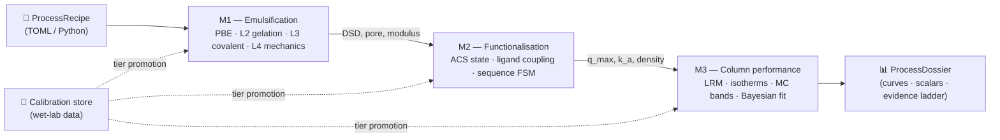
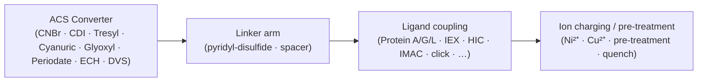
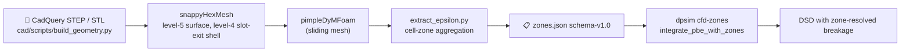

# DPSim — Downstream Processing Simulator

**Polysaccharide-microsphere fabrication, functionalisation, and affinity-chromatography lifecycle simulator.**

[](LICENSE)
[](https://www.python.org/downloads/)
[](CHANGELOG.md)
[](https://github.com/tocvicmeng-prog/Downstream-Processing-Simulator/releases)

> Turn a written lifecycle recipe into predicted microsphere-media behaviour **before** you touch the bench. Every numeric output ships with units, an evidence tier, the assumptions it depends on, the validation gates it has cleared, and the wet-lab caveats that bound it — so each value tells you exactly how much to trust it.



*Static PNG of every diagram in this README is in [`docs/figures/`](docs/figures/) for offline / print rendering.*

---

## Table of Contents

- [What DPSim Does](#what-dpsim-does)
- [Confidence Model](#confidence-model)
- [Capabilities at a Glance](#capabilities-at-a-glance)
- [Microsphere Fabrication Pathways](#microsphere-fabrication-pathways)
- [Hardware Geometry and CFD-PBE Coupling](#hardware-geometry-and-cfd-pbe-coupling)
- [Installation](#installation)
- [System Requirements](#system-requirements)
- [Quickstart](#quickstart)
- [Repository Structure](#repository-structure)
- [Numerical Solver Matrix](#numerical-solver-matrix)
- [Development Philosophy](#development-philosophy)
- [Limits and the Wet-Lab Loop](#limits-and-the-wet-lab-loop)
- [Documentation Map](#documentation-map)
- [Version History](#version-history)
- [Intellectual Property and Licence](#intellectual-property-and-licence)
- [Citation](#citation)
- [Contributing and Support](#contributing-and-support)
- [Disclaimer](#disclaimer)

---

## What DPSim Does

DPSim is a **lifecycle simulator** for polysaccharide-based affinity microsphere media. The simulator is organised as three sequential modules whose outputs feed strictly downstream:

| Module | Wet-lab stage | Predicted outputs |
|---|---|---|
| **M1** | Double-emulsification microsphere fabrication | Bead size distribution (DSD: d₁₀ / d₃₂ / d₅₀ / d₉₀), pore architecture, mechanical modulus, residual oil / surfactant after wash |
| **M2** | Functionalisation, reinforcement, ligand coupling | Reactive-site inventory (the `ACSSiteType` state vector), ligand density, activity retention, leaching / wash caveats |
| **M3** | Affinity-column performance | Pack / equilibrate / load / wash / elute behaviour, breakthrough curve, pressure profile, dynamic binding capacity (DBC), recovery, optional Monte-Carlo P05/P50/P95 envelopes |

The simulator exists for one reason: **screening**. It tells you what to expect, with explicit uncertainty, so you can narrow your bench parameter space, predict failure modes, and plan calibration experiments before consuming reagents and operator time.

---

## Confidence Model

Internalise these two ideas before reading any DPSim result.

### Five-tier evidence vocabulary

| Tier | Meaning | When to trust |
|---|---|---|
| `validated_quantitative` | Calibrated against this specific system | Suitable for design within the validated domain |
| `calibrated_local` | Fitted to local wet-lab data; not yet broadly cross-validated | Suitable for screening and local interpolation |
| `semi_quantitative` | Literature-parameterised or mechanistically plausible | Trends are useful; magnitudes are approximate |
| `qualitative_trend` | Directional or ranking-only | Use for screening and hypothesis generation only |
| `unsupported` | Chemistry, unit, regime, or operation not represented | **Do not use for decisions** |

### Tier inheritance — downstream cannot exceed upstream


If M1 is `qualitative_trend`, the entire downstream pipeline is capped at `qualitative_trend`. The simulator does not allow M2 or M3 to claim more confidence than their inputs. The rule is enforced in `RunReport.compute_min_tier`.

### When the number is good enough

| Decision | Required evidence tier |
|---|---|
| Hypothesis generation, parameter-space narrowing | `qualitative_trend` is enough |
| Choice between two screening alternatives | `semi_quantitative` |
| Quantitative process design (e.g. column scale-up) | `calibrated_local` or `validated_quantitative` |
| Regulatory submission or release | DPSim is **never** sufficient on its own |

---

## Capabilities at a Glance

### Modelling

- **21 polymer families** spanning the v9.1 baseline (4: agarose-chitosan, alginate, cellulose-NIPS, PLGA), the v9.2 / v9.3 expansion (10), the v9.4 niche set (4), and the v9.5 multi-variant composites (3).
- **103 functionalisation reagents** across **18 chemistry buckets**: secondary crosslinking; **ACS conversion** (ECH, DVS, plus the six v0.5.0 routes CNBr / CDI / Tresyl / Cyanuric / Glyoxyl / Periodate); **arm-distal activation** (pyridyl-disulfide, v0.5.0); ligand coupling (IEX, HIC, IMAC, GST, heparin); protein coupling (Protein A / G / L canonical and Cys variants on maleimide and pyridyl-disulfide); spacer arms; metal charging; protein pre-treatment, washing, quenching; and eight specialty buckets (click, dye pseudo-affinity, mixed-mode HCIC, thiophilic, boronate, peptide-affinity, oligonucleotide, material-as-ligand).
- **13 ion-gelant profiles** (per-family + freestanding) carrying biotherapeutic-safety flags (e.g. Al³⁺ flagged unsafe for clinical use under FDA/EP residue limits).
- **26 surface-chemistry site types** tracked through the M2 `ACSSiteType` state vector; PYRIDYL_DISULFIDE is the most recent addition (v0.5.0).
- **Sequence-enforcing finite-state machine** (v0.5.0 G6) — recipes are validated at load time against the canonical chemistry order *ACS Converter → Linker Arm → Ligand → Ion-charging*, with arm-distal preconditions, metal-charge preconditions, and a hard 15-min CNBr coupling-window enforcement (v0.5.1 G6.5):



- **Cyanuric-chloride 3-stage staged kinetics** (v0.5.1) — per-Cl rate constants for the 1st (0–5 °C), 2nd (25 °C), and 3rd (60–80 °C) substitution events, each ~10× slower than the previous due to electron donation from prior substituents.
- **Periodate / glyoxyl chain-scission penalty** (v0.5.1) — `G_DN` is multiplicatively reduced when oxidative converters exceed their conversion threshold (periodate up to 30 % / 70 % loss; glyoxyl-chained 40 % / 50 %).
- **Lumped Rate Model (LRM)** chromatography solver with axial-dispersion + film mass transfer + Langmuir adsorption.
- **Monte-Carlo LRM uncertainty driver** (v0.3.0) — propagates posterior uncertainty in q_max / K_L / pH parameters through the LRM and reports P05 / P50 / P95 envelopes on every metric and curve. Convergence is judged by quantile-stability plateau plus inter-seed posterior overlap; R-hat is informational only.
- **Optional Bayesian posterior fitting** (v0.3.1) — `fit_langmuir_posterior()` via PyMC / NUTS, behind the `[bayesian]` extra (~700 MB). R-hat / ESS / divergence convergence gates are mandatory and raise `BayesianFitConvergenceError` on failure.
- **Calibration store** for ingesting wet-lab measurements and overriding screening defaults via the YAML wetlab-ingestion path.
- **Evidence-tier inheritance** — every predicted value carries a tier; the inheritance rule above is enforced.

### CFD-PBE coupling for M1 scale-up (v0.6.0 → v0.6.2)

- **Schema-v1.0** `zones.json` contract (`cad/cfd/zones_schema.md`) with two ε per zone: `epsilon_avg` for coalescence, `epsilon_breakage_weighted` for breakage.
- **Pydantic v2 zonal-PBE loader** with 11 hard validation paths; **bit-exact reduction to the bare PBE solver** in the 1-zone degenerate case.
- **`dpsim cfd-zones` CLI subcommand** with material overrides, kernel preset, and optional `--legacy-eps` cross-check against the legacy Po · N³ · D⁵ / V_tank empirical estimate (30 % tolerance gate).
- **OpenFOAM case scaffold** (`cad/cfd/cases/`) for both stirrer geometries with zone definitions, refinement levels, and the `extract_epsilon.py` post-processor that emits the schema-v1.0 zones.json.

### User-facing surfaces

- **Streamlit dashboard** at `localhost:8501` — seven-step lifecycle workflow with interactive inputs, per-module result panels, validation report, evidence ladder, run history, and a live cross-section animation in the M1 *Hardware · Emulsification* box (4-state toggle: side / bottom × opaque / transparent; streamline-following droplets; explicit break-up event animation).
- **CLI** — `python -m dpsim run | lifecycle | recipe | ui | cfd-zones` for batch processing and CI integration.
- **Python API** — direct access to `DownstreamProcessOrchestrator`, `run_method_simulation`, `run_mc`, `fit_langmuir_posterior`, `integrate_pbe_with_zones`, and the calibration store.
- **Bundled documentation** — First Edition manual + Appendix J wet-lab protocols + Appendix K CFD-PBE zonal coupling reference, all reachable from the dashboard's upper-right corner.

---

## Microsphere Fabrication Pathways

DPSim covers **six classes** of polysaccharide-microsphere fabrication chemistry. The default first-run recipe is Pathway 1 (AGAROSE_CHITOSAN + Protein A); the others are reachable from the M1 family selector.

| # | Pathway | Mechanism (one-liner) | Polymer families | Strengths | Trade-offs |
|---|---|---|---|---|---|
| 1 | Thermal helix-coil + covalent secondary network | Hot agarose ± chitosan emulsified into oil; cooling drives helix-coil junctions; an amine-reactive crosslinker (genipin / glutaraldehyde / ECH / DVS / BDDE / STMP) locks chitosan as a second IPN | AGAROSE_CHITOSAN (default), AGAROSE, CHITOSAN, AGAROSE_DEXTRAN | High modulus (1–10 MPa), well-validated, protein-compatible | Slow crosslinking (genipin: 24 h), hot emulsification, blue tint from genipin |
| 2 | Ionotropic gelation (egg-box / helix aggregation) | Anionic polysaccharide droplets meet a multivalent cation bath; bridges form near-instantly. No covalent chemistry | ALGINATE (Ca²⁺), KAPPA_CARRAGEENAN (K⁺), PECTIN (Ca²⁺, low-methoxy), GELLAN (K⁺ or Ca²⁺), HYALURONATE (Ca²⁺ cofactor; covalent BDDE canonical) | Room-temperature, mild on biology, food-grade options | Ionic crosslinks dissolve in saline / pH extremes; lower modulus (~10–50 kPa). Trivalent gelants (Al³⁺) stronger but biotherapeutic-unsafe |
| 3 | Non-Solvent-Induced Phase Separation (NIPS) | Cellulose dissolved in NaOH/urea, NMMO, ionic liquid, or DMAc/LiCl; emulsified droplets contact water; Cahn-Hilliard phase separation gives porous network. Quench depth controls morphology | CELLULOSE — sub-routes `naoh_urea`, `nmmo`, `emim_ac`, `dmac_licl` | Bicontinuous porosity, excellent protein compatibility, no covalent crosslinker | Solvent recovery dominates cost; the Cahn-Hilliard L2 solver is the simulator's most numerically demanding model |
| 4 | Solvent-evaporation glassy microspheres | PLGA/DCM emulsified into aqueous PVA; DCM diffuses out and evaporates; PLGA vitrifies as glassy microsphere below T_g. No crosslinking | PLGA — grade presets 50:50, 75:25, 85:15, 100:0 (PLA) | Bioresorbable, FDA-familiar, tunable degradation | Organic-solvent handling; potential drug degradation during evaporation; glassy mechanics (>1 GPa) |
| 5 | Material-as-ligand (B9 pattern) | The polymer matrix *is* the affinity ligand. No coupling chemistry; M3 elutes by competitive eluent | AMYLOSE (captures MBP-tagged fusions; eluent 10 mM maltose), CHITIN (captures CBD/intein fusions, NEB IMPACT; 50 mM DTT triggers self-cleavage) | No coupling step; orthogonal selectivity | Limited capacity vs Protein A; tag-dependent |
| 6 | Multi-variant composites (v9.5) | IPN or PEC architectures combining two pathways for pH-controlled release or food-texture targets | AGAROSE_ALGINATE (Chen 2022), ALGINATE_CHITOSAN (Liu 2017), PECTIN_CHITOSAN (Birch 2014), GELLAN_ALGINATE (Pereira 2018), PULLULAN_DEXTRAN (Singh 2008) | Tunable response window; richer mechanical envelope | Two coupled chemistries → higher calibration burden |

The full polymer-family selection chart, with chemistry-to-application mapping and primary references, is in [`docs/user_manual/polysaccharide_microsphere_simulator_first_edition.md`](docs/user_manual/polysaccharide_microsphere_simulator_first_edition.md) §5.5.

---

## Hardware Geometry and CFD-PBE Coupling

M1 supports two hardware modes selected at recipe time. Each ships parametric CAD geometry (CadQuery → STEP AP242 + STL) plus an OpenFOAM case scaffold for ε-field validation.

| Mode | Geometry | Use case |
|---|---|---|
| **Stirrer A** | Disk Ø 59 mm × 1 mm with 19 perimeter tabs (10 UP / 9 DOWN, alternating; 10° tangential pitch). Pitched-blade impeller in a 100 mL beaker | Pitched-blade reference; figure-8 axial recirculation |
| **Stirrer B** | Cross rotor (Ø 25.7 mm × 16 mm) inside a perforated stator (Ø 32.03 × 18 mm, 2.2 mm wall, **72 Ø 3 mm perforations** in a 3 × 24 rectangular grid, closed top with Ø 10 mm shaft passage) | High-shear rotor-stator; the canonical breakage-jet geometry |

### Why the slot exit matters

Padron 2005 and Hall 2011 establish that **80–95 % of breakage in rotor-stator devices happens in the small region just outside each stator perforation**, where rotating fluid blasts through the gap and dissipates suddenly. A volume-averaged ε will therefore systematically under-predict breakage. DPSim's CFD-PBE coupling (v0.6.2) addresses this by partitioning the vessel into zones — `impeller`, `slot_exit`, `near_wall`, `bulk` — each carrying its own ε for breakage and for coalescence, which the zonal PBE then integrates with one-way convective exchanges:



The pipeline is shipped as a starting point. End-to-end predictions for absolute scale-up require a PIV validation campaign (envelope in Appendix K §K.4.6).

---

## Installation

DPSim ships **three** installation paths.

### 1. One-click Windows installer (recommended for end-users)

> [**Releases → DPSim-Setup.exe (latest)**](https://github.com/tocvicmeng-prog/Downstream-Processing-Simulator/releases/latest)

Double-click the `.exe`. The installer:

1. Shows the EULA page first — Holocyte Pty Ltd IP, GPL-3.0, GitHub source URL.
2. Installs to `%LOCALAPPDATA%\Programs\DPSim` (per-user; no admin needed).
3. Detects whether Python 3.11 / 3.12 is on PATH and offers to open the python.org download page if missing.
4. Creates an isolated `.venv\` and pip-installs the bundled wheel.
5. Adds Start-Menu and (optional) desktop shortcuts.
6. Offers to launch the dashboard immediately.

### 2. Portable ZIP (no installation)

> [**Releases → DPSim-Windows-x64-portable.zip (latest)**](https://github.com/tocvicmeng-prog/Downstream-Processing-Simulator/releases/latest)

Extract anywhere (e.g. `D:\Apps\DPSim`). Run `install.bat` once, then `launch_ui.bat`. To uninstall, delete the folder — no registry or Start-Menu trace.

### 3. Source install (developers)

```bash
git clone https://github.com/tocvicmeng-prog/Downstream-Processing-Simulator
cd Downstream-Processing-Simulator
pip install -e .
```

Optional extras:

```bash
pip install -e ".[dev]"           # tests + linting
pip install -e ".[ui]"            # streamlit + plotly
pip install -e ".[optimization]"  # botorch + gpytorch + torch
pip install -e ".[bayesian]"      # pymc + arviz (NUTS posterior fit)
pip install -e ".[all]"           # everything
```

For an in-place check without installing:

```powershell
$env:PYTHONPATH = "src"
python -m dpsim lifecycle configs/fast_smoke.toml
```

---

## System Requirements

| Requirement | Supported | Notes |
|---|---|---|
| Operating system | Windows 11 x64 (Windows 10 x64 also works) | macOS / Linux work for the source install but no native installer is shipped |
| Python | **3.11 or 3.12** | 3.13+ unsupported per [`docs/decisions/ADR-001`](docs/decisions/) (scipy BDF + numba JIT cache issues) |
| RAM | 8 GB recommended (4 GB minimum) | MC-LRM with N ≥ 1000 samples can use 1–2 GB |
| Disk | 2 GB free for the local `.venv\` | Wheel itself is ≈ 2 MB |
| Network | Internet during first install | pip downloads ~1 GB of scientific dependencies |
| GPU | Not required | Optional for `[optimization]` extra (BoTorch on CUDA) |

---

## Quickstart

### Launch the dashboard

```bash
python -m dpsim ui
```

The dashboard binds to `http://localhost:8501`. Your default browser should open automatically.

### First-run recipe

The default recipe is **agarose-chitosan + Protein A**, calibrated for first-time users:

1. On M1, open the **Polymer Family** tab and leave AGAROSE_CHITOSAN selected.
2. On M2, pick the `epoxy_protein_a` template.
3. On M3, leave the default Protein A method (bind pH 7.4, elute pH 3.5).
4. Click **Run Lifecycle Simulation**.
5. Review the **Validation & Evidence** panel — every numeric output carries its evidence tier.

### CLI examples

```bash
python -m dpsim run configs/default.toml
python -m dpsim recipe export-default --output recipe.toml
python -m dpsim lifecycle configs/fast_smoke.toml --recipe recipe.toml
python -m dpsim cfd-zones --zones zones.json --kernel alopaeus
```

### Python API

```python
from dpsim.lifecycle import DownstreamProcessOrchestrator

result = DownstreamProcessOrchestrator().run()
print(result.weakest_evidence_tier.value)
print(result.functional_media_contract.installed_ligand)
print(result.m3_breakthrough.dbc_10pct)
```

### Monte-Carlo uncertainty (advanced)

```python
from dpsim.calibration import PosteriorSamples
from dpsim.module3_performance.mc_solver_lambdas import make_langmuir_lrm_solver
from dpsim.module3_performance.monte_carlo import run_mc

samples = PosteriorSamples.from_marginals(
    parameter_names=("q_max", "K_L"),
    means=[50.0, 1e-3],
    stds=[2.5, 1e-4],
)
solver = make_langmuir_lrm_solver(column=col, C_feed=1.0, ...)
bands = run_mc(samples, solver, n=200, n_seeds=4, n_jobs=4)
print(bands.scalar_quantiles["mass_eluted"])  # P05 / P50 / P95
```

---

## Repository Structure

```
Downstream-Processing-Simulator/
├── src/dpsim/                          # Production source
│   ├── core/                           # Quantities, parameters, ProcessRecipe, evidence roll-up
│   ├── lifecycle/                      # M1→M2→M3 orchestrator
│   ├── pipeline/                       # M1 fabrication pipeline (legacy L1-L4 kernels; called by lifecycle)
│   ├── level1_emulsification/          # Population balance + hydrodynamics
│   ├── level2_gelation/                # Polymer-family L2 solvers + composite dispatch + ion registry
│   ├── level3_crosslinking/            # Primary network kinetics
│   ├── level4_mechanical/              # Bead mechanics
│   ├── module2_functionalization/      # ACS state, REAGENT_PROFILES, reactions, sequence FSM
│   ├── module3_performance/            # LRM, isotherms, hydrodynamics, MC-LRM driver, solver-lambdas
│   ├── cfd/                            # Schema-v1.0 zonal-PBE loader + integrator (v0.6.2)
│   ├── calibration/                    # Calibration data, store, wet-lab ingestion, posterior samples, Bayesian fit
│   ├── visualization/                  # Streamlit app, M1/M2/M3 tabs, plot modules, live xsec animation
│   ├── optimization/                   # Bayesian optimisation (optional [optimization] extra)
│   ├── reagent_library*.py             # M1 crosslinker / surfactant / gelant registries
│   └── datatypes.py                    # PolymerFamily, ACSSiteType, ModelEvidenceTier, ModelMode enums
│
├── cad/                                # Parametric CAD geometry (v0.6.0)
│   ├── scripts/build_geometry.py       # CadQuery generator for Stirrer A/B + beaker + jacketed vessel
│   ├── output/                         # Generated STEP AP242 + STL
│   └── cfd/                            # OpenFOAM case scaffold + post-processor + zone schema
├── tests/                              # 510+ tests across all modules + AST gates
├── configs/                            # Default + smoke + stirred-vessel TOML recipes
├── data/wetlab_calibration_examples/   # Example wet-lab campaigns (YAML)
├── docs/
│   ├── user_manual/                    # First Edition manual + Appendix J + Appendix K + PDFs
│   ├── figures/                        # PNG renders of README Mermaid diagrams (regeneration script included)
│   ├── handover/                       # Cycle handovers (planning + close documents)
│   ├── decisions/                      # ADRs
│   └── *.md                            # Topic-specific design notes
├── installer/                          # Inno Setup .iss + build script + EULA + templates
├── DESIGN.md                           # Visual / UI design system (read before any UI change)
├── CLAUDE.md                           # Project-specific contributor guidelines
├── CHANGELOG.md                        # Version history
├── LICENSE                             # GPL-3.0 full text
├── NOTICE                              # IP attribution (Holocyte Pty Ltd)
└── pyproject.toml                      # Package metadata, dependencies, extras
```

> **Note on the dual M1 codepath.** `pipeline/` hosts the legacy L1-L4 kernels that are still load-bearing for M1 fabrication; `level1_emulsification/` is the population-balance / hydrodynamics layer that the lifecycle orchestrator and the CFD-PBE coupling both consume. Both are real and current; do not delete one looking for the other.

---

## Numerical Solver Matrix

| Model | Default solver | Rationale |
|---|---|---|
| Population balance (M1 emulsification) | scipy LSODA | Non-stiff PBE moments |
| Cahn-Hilliard NIPS (cellulose) | Spectral semi-implicit | Stiff fourth-order PDE |
| Lumped Rate Model (M3, default) | `solve_ivp(method="BDF")` | Non-gradient case |
| LRM with gradient elution | BDF | LSODA oscillates with time-varying binding equilibrium |
| Catalysis packed bed (PFR + Michaelis-Menten) | LSODA | ~700× faster than BDF on the non-stiff problem |
| MC-LRM tail samples | BDF with 10× tightened tolerances | Tier-1 numerical safeguard per SA-Q1 / D-046 |
| Zonal PBE integrator (CFD-PBE) | LSODA via `solve_ivp` | Reuses Alopaeus and Coulaloglou-Tavlarides kernels |

LSODA fallback for high-affinity Langmuir paths is **explicitly rejected** — the codebase has documented LSODA stalls there.

---

## Development Philosophy

1. **First-principles decomposition.** Every model is reasoned from physics or chemistry first; convention follows analysis. Algorithm choices are justified by complexity, convergence, and numerical stability.
2. **Modularity and the parallel-module pattern.** Adding a new polymer family does **not** modify existing solvers. A new file is created alongside; the new family delegates to the closest existing solver in a sandbox, then re-tags the result with family-specific manifest provenance. This guarantees bit-for-bit equivalence with calibrated kernels by construction (D-016 / D-017 / D-027 / D-037).
3. **Evidence as a first-class citizen.** Every value carries a tier. Every assumption is surfaced. Every model has a `ModelManifest` with `evidence_tier`, `valid_domain`, `assumptions`, `diagnostics`, and `calibration_ref` fields. The UI displays them; users cannot accidentally use an `unsupported` value.
4. **Computational economics.** Every design decision considers compute / memory / time cost against the value of the output. Over-engineering is a defect. Solver tolerances and integration bounds are tuned per model (see `CLAUDE.md`).
5. **Reproducibility and auditability.** Every pipeline run produces deterministic or statistically-characterised outputs. All parameters, seeds, and environmental dependencies are documented. Any result can be reproduced from the `ProcessRecipe`.

### Quality gates (CI-enforced)

- **ruff = 0** — zero lint warnings.
- **mypy = 0** — zero type errors on new files.
- **AST enum-comparison gate** — `tests/test_v9_3_enum_comparison_enforcement.py` walks `src/dpsim/` and `tests/`, failing the build on any `is` / `is not` comparison against `PolymerFamily`, `ACSSiteType`, `ModelEvidenceTier`, or `ModelMode`. Reason: Streamlit reloads `dpsim.datatypes` on every rerun, minting a new enum class — identity comparisons silently break after the first rerun.
- **Smoke baseline preservation** — every release verifies that legacy v0.2.x output is byte-identical when the new feature is opted out (e.g. `monte_carlo_n_samples = 0`).
- **Coverage gates** — every reagent in `REAGENT_PROFILES` must surface in at least one M2 dropdown bucket; every value in `ALLOWED_FUNCTIONAL_MODES` must live in exactly one bucket.

---

## Limits and the Wet-Lab Loop

### What DPSim is not

- Not a regulatory tox / stability study substitute.
- Not a GMP batch-record generator (the exported wet-lab SOP is a development scaffold).
- Not a guarantee of clinical, diagnostic, or manufacturing fitness.
- Not a predictor for novel polymers outside the family registry.
- Not a refusal engine — it warns when you exceed validation regimes, but it still runs.

### The wet-lab loop

DPSim is a screening tool first. The wet-lab loop turns it into a quantitative tool for *your* specific system:

1. Run a screening simulation. Get `semi_quantitative` magnitudes.
2. The validation report tells you which assays will most reduce uncertainty.
3. Upload measured data into the calibration store (`dpsim.calibration.wetlab_ingestion` accepts YAML campaigns; examples in `data/wetlab_calibration_examples/`).
4. Re-run. The simulator now reports `calibrated_local` evidence within the validated domain.

### Hazard considerations

The reagent library covers 103 chemistries. Several are classified as carcinogenic, mutagenic, reproductively toxic, or strongly sensitising (e.g. CNBr, glutaraldehyde, DCM, cyanuric chloride, AlCl₃, borax). Every reagent profile carries a `hazard_class` field that the UI surfaces, and Appendix J carries SDS-lite blocks for every reagent. **Always consult your institution's safety office and the reagent's full SDS before bench work.**

---

## Documentation Map

### User-facing (start here)

| File | Audience | Purpose |
|---|---|---|
| [`docs/user_manual/polysaccharide_microsphere_simulator_first_edition.md`](docs/user_manual/polysaccharide_microsphere_simulator_first_edition.md) | Operators, junior researchers | Comprehensive instruction manual: workflow, polymer families, M2 chemistry, M3 / MC, calibration, formulas, troubleshooting |
| [`docs/user_manual/appendix_J_functionalization_protocols.md`](docs/user_manual/appendix_J_functionalization_protocols.md) | Wet-lab researchers | 103-reagent functionalisation protocols with SDS-lite hazard blocks |
| [`docs/user_manual/appendix_K_cfd_pbe_zonal_coupling.md`](docs/user_manual/appendix_K_cfd_pbe_zonal_coupling.md) | Process engineers | CFD-PBE zonal coupling — zone partitioning, mesh requirements, validation envelope |
| [`docs/quickstart.md`](docs/quickstart.md) | First-time users | One-page getting-started |
| [`docs/configuration.md`](docs/configuration.md) | All users | TOML and `ProcessRecipe` parameter reference |
| [`docs/INDEX.md`](docs/INDEX.md) | All users | Documentation navigation |
| `docs/user_manual/*.pdf` | All users | Built PDF versions of the manual + appendices — also accessible from the dashboard |

### Developer

| File | Audience | Purpose |
|---|---|---|
| [`CLAUDE.md`](CLAUDE.md) | Contributors | Project-specific contributor guidelines, solver matrix, AST gate, quirks |
| [`DESIGN.md`](DESIGN.md) | UI contributors | Visual / UI design system (typography, palette, semantic colours) |
| [`CHANGELOG.md`](CHANGELOG.md) | All | Per-release feature log |
| [`docs/handover/`](docs/handover/) | Maintainers | Per-cycle handover documents (planning + close) |
| [`docs/decisions/`](docs/decisions/) | Maintainers | Architecture Decision Records (ADRs) |
| [`docs/DPS_CLEAN_SLATE_ARCHITECTURE.md`](docs/DPS_CLEAN_SLATE_ARCHITECTURE.md) | Architects | Clean-slate architecture reference |
| [`installer/README.md`](installer/README.md) | Release engineers | Windows installer + portable ZIP build pipeline |
| [`docs/figures/README.md`](docs/figures/README.md) | All | Mermaid sources + PNG exports of every diagram in this README |

---

## Version History

DPSim follows a **fork-line versioning** convention: `v0.x` is the DPSim fork's release line; `v9.x` is the upstream simulator's release line (last upstream release `v9.2.2` on 2026-04-24). Internal cycle labels (Tier-1/2/3 batches, G1–G5 module groups) are orthogonal to either version line.

| Version | Date | Headline |
|---|---|---|
| **v0.6.3** | 2026-05-04 | Stirrer B stator hole-count correction (3 × 12 = 36 → 3 × 24 = 72) — physically faithful CAD + UI animation |
| **v0.6.2** | 2026-05-01 | CFD-PBE zonal coupling end-to-end — schema-v1.0 zones.json, zonal PBE integrator, OpenFOAM post-processor, `dpsim cfd-zones` CLI |
| **v0.6.0** | 2026-05-01 | CAD geometry handoff + OpenFOAM CFD-PBE scaffolding + Stirrer A xsec v2 (parametric CadQuery generator; live cross-section animation) |
| **v0.5.2** | 2026-04-27 | Codex-review fixes for v0.5.1 release-breakers |
| **v0.5.1** | 2026-04-27 | ACS Converter deferred-work follow-on (cyanuric staged kinetics; periodate / glyoxyl chain-scission penalty) |
| **v0.5.0** | 2026-04-27 | M2 ACS Converter epic — 7 ACS-converter reagents, G6 sequence FSM, `PYRIDYL_DISULFIDE` site type |
| **v0.4.19** | 2026-04-26 | Direction-A standalone alignment + Streamlit 1.55 fixes |
| **v0.3.8** | 2026-04-25 | Release tooling — Windows installer + portable ZIP pipeline |
| **v0.3.7** | 2026-04-25 | First Edition manual refresh + Appendix J v0.3.x addendum |
| **v0.3.6** | 2026-04-25 | Closed all v0.3.x follow-ons (alkyne reference; joblib MC; pectin DE / gellan K⁺ / pullulan STMP variants) |
| **v0.3.5** | 2026-04-25 | UI audit follow-ons (ion-gelant picker; ACS visibility; crosslinker registry split) |
| **v0.3.4** | 2026-04-25 | M2 dropdown coverage 50/94 → 94/94; 8 new chemistry buckets |
| **v0.3.3** | 2026-04-25 | v9.5 Tier-3 multi-variant composites |
| **v0.3.2** | 2026-04-25 | UI bands + ProcessDossier MC export (G5) |
| **v0.3.1** | 2026-04-25 | Optional Bayesian posterior fitting (G4) |
| **v0.3.0** | 2026-04-25 | MC-LRM uncertainty propagation (G1+G2+G3) |
| **v0.2.0** | 2026-04-25 | Functional optimisation (Tiers 1-3) — 14 polymer families, 50 reagent profiles, ACS extension |
| **v0.1.0** | 2026-04-19 | Initial DPSim fork — package rename, lifecycle CLI, clean-slate architecture |

The full per-release change log is in [`CHANGELOG.md`](CHANGELOG.md).

---

## Intellectual Property and Licence

### Intellectual property

The intellectual property in this software, including the source code, documentation, simulator architecture, M2 chemistry state model, M3 chromatography solvers, calibration framework, MC-LRM uncertainty driver, CFD-PBE zonal coupling, parametric CAD geometry, and accompanying assets, **belongs to Holocyte Pty Ltd**.

See [`NOTICE`](NOTICE) for the full project ownership notice.

### Licence

DPSim is distributed under the **GNU General Public License, version 3.0 (GPL-3.0)**. The full licence text is in [`LICENSE`](LICENSE) and is also available at <https://www.gnu.org/licenses/gpl-3.0.en.html>.

The key user rights granted by GPL-3.0 are:

- the freedom to **run** the program for any purpose,
- the freedom to **study** how the program works and adapt it,
- the freedom to **redistribute** copies, and
- the freedom to **modify** and release improved versions.

Redistributions and derivative works must themselves be licensed under GPL-3.0 and must make their source code available.

### Source code availability

The canonical source-code repository is on GitHub at:

> <https://github.com/tocvicmeng-prog/Downstream-Processing-Simulator>

Each tagged release is available under the **Releases** tab.

### Third-party licences

Bundled dependencies retain their upstream licences:

- numpy, scipy, pandas, matplotlib (BSD)
- streamlit, plotly (Apache 2.0 / MIT)
- pydantic, h5py (MIT / BSD)
- botorch, gpytorch, pytorch (BSD / MIT) — optional `[optimization]` extra
- pymc, arviz (Apache 2.0) — optional `[bayesian]` extra
- cadquery (Apache 2.0) — used by the CAD geometry generator

See `pyproject.toml` for the pinned versions.

---

## Citation

If you use DPSim in published work, please cite:

```
Holocyte Pty Ltd. (2026). DPSim — Downstream Processing Simulator (v0.6.3).
GNU General Public License v3.0.
https://github.com/tocvicmeng-prog/Downstream-Processing-Simulator
```

### BibTeX

```bibtex
@software{holocyte_dpsim_2026,
  author       = {{Holocyte Pty Ltd}},
  title        = {{DPSim} --- {Downstream Processing Simulator}},
  year         = {2026},
  version      = {v0.6.3},
  url          = {https://github.com/tocvicmeng-prog/Downstream-Processing-Simulator},
  license      = {GPL-3.0-or-later},
  note         = {Polysaccharide-microsphere fabrication, functionalisation, and affinity-chromatography lifecycle simulator}
}
```

For the underlying scientific methods, please also cite the primary literature referenced in Appendix J and in each `ReagentProfile.calibration_source` field.

---

## Contributing and Support

### Reporting issues

Open an issue at the GitHub repository:

> <https://github.com/tocvicmeng-prog/Downstream-Processing-Simulator/issues>

Include:

- DPSim version (`python -c "import dpsim; print(dpsim.__version__)"`)
- Python version (`python --version`)
- Operating system
- Reproducer recipe (TOML or Python snippet)
- Expected vs observed behaviour
- Full traceback if applicable

### Pull requests

Please read [`CLAUDE.md`](CLAUDE.md) and [`DESIGN.md`](DESIGN.md) before submitting a PR. Key gates:

- ruff = 0 and mypy = 0 on changed files
- Tests pass locally on Python 3.11 or 3.12
- AST enum-comparison gate clean
- Smoke baseline preserved (legacy paths byte-identical when the new feature is opted out)
- DESIGN.md compliance for any UI change

### Wet-lab calibration data

If you have wet-lab data that could improve DPSim's parameterisation, please open an issue describing the assay, conditions, and result. The calibration-ingestion path (`dpsim.calibration.wetlab_ingestion`) accepts YAML campaigns; example campaigns are in `data/wetlab_calibration_examples/`.

### Commercial support

Commercial users requiring SLA-backed support, custom calibration campaigns, or non-GPL licensing should contact Holocyte Pty Ltd directly via the channels listed on the GitHub repository.

---

## Disclaimer

DPSim and its documentation are provided **for informational, research, and screening purposes only**. They do not constitute professional engineering advice, medical advice, regulatory submission, or formal peer review.

Every result must be interpreted with explicit unit-consistency checks; pH, temperature, reagent, and buffer compatibility checks; calibration-domain checks; M1 residual oil / surfactant carryover limits; M2 site and mass balance, ligand density, leaching, free-protein wash, and activity-retention assays; and M3 pressure, compression, Reynolds-Peclet, breakthrough, and recovery checks — alongside explicit assumptions and wet-lab caveats.

DPSim does **not** prove a resin is fit for clinical, diagnostic, or manufacturing use without independent calibration, release assays, and process validation. The exported wet-lab SOP is a **development scaffold** that must be reviewed under your local safety and quality systems before bench execution.

---

*DPSim is © Holocyte Pty Ltd, 2026. Released under GNU GPL-3.0. Source: <https://github.com/tocvicmeng-prog/Downstream-Processing-Simulator>.*
