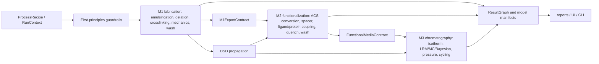

# Downstream Processing Simulator Functional Architecture Audit

**Date:** 2026-05-04  
**Repository:** `C:\Users\tocvi\OneDrive\文档\Project_Code\EmulSim\Downstream_Processing_Simulator`  
**GitHub:** `https://github.com/tocvicmeng-prog/Downstream-Processing-Simulator`  
**Inspected branch:** `main`  
**Inspected head before audit edits:** `eea8776` (`docs(readme): senior-editor rewrite + Mermaid diagrams + figure assets`)  
**Auditor stance:** computational simulation scientist, downstream-processing engineer, and wet-lab chemistry reviewer.

## 1. Executive Verdict

DPSim has a technically feasible architecture for research-grade lifecycle simulation of microsphere fabrication, ligand functionalization, and affinity chromatography performance. The strongest design choices are:

- explicit M1 -> M2 -> M3 contracts rather than implicit shared state;
- model manifests with evidence tiers, assumptions, diagnostics, and caveats;
- first-principles recipe guardrails for mass balance, chemistry order, and process-state consistency;
- family-aware trust downgrades and calibration-domain gates;
- an increasingly clean separation between process recipe, mechanistic solver, and UI presentation.

The system is not yet scientifically valid for release, GMP, equipment-scale transfer, or resin-lot acceptance decisions without user-supplied calibration data. Many outputs are appropriate as semi-quantitative design screens, but the code still contains open gaps around pH/pKa chemistry guardrails, pore-model calibration, residual reagent/wash modelling, CFD validation, and Python environment reproducibility.

During this audit I fixed several low-risk implementation inconsistencies and added regression tests. Remaining issues below include implementation suggestions for completion.

## 2. Audit Method

Inspected:

- top-level architecture and user documentation: `README.md`, `DESIGN.md`, `docs/01_scientific_advisor_report.md`, `docs/02_computational_architecture.md`, `docs/03_architecture_modification_plan.md`, `docs/configuration.md`, and CFD/manual appendices;
- core data contracts: `src/dpsim/datatypes.py`, `src/dpsim/core/process_recipe.py`, `src/dpsim/core/recipe_validation.py`, `src/dpsim/core/result_graph.py`, `src/dpsim/core/evidence.py`;
- lifecycle orchestration: `src/dpsim/lifecycle/orchestrator.py`, `src/dpsim/pipeline/orchestrator.py`;
- M1 solvers: emulsification PBE, gelation, family dispatch, mechanics, CFD-PBE coupling;
- M2 chemistry: ACS profiles, reagent profiles, modification step dispatch, backend workflow preflight;
- M3 chromatography: method orchestration, LRM transport, Protein A/HIC/isotherm adapters, calibration and mode guards;
- tests around the changed code paths.

No new wet-lab datasets, CFD cases, or external literature database were supplied in this session. Scientific validity is therefore assessed as model-structure validity, unit/evidence/provenance consistency, and feasibility of calibration pathways.

## 3. Current Functional Architecture



The high-level architecture is coherent. The most important correctness principle is that every downstream prediction inherits the weakest credible evidence tier of its upstream material, chemistry, and performance model. This is implemented in several places, but must remain a central policy rather than a pattern repeated by identity-sensitive enum comparisons.

## 4. Fixes Implemented During This Audit

| ID | Status | Area | Change |
| --- | --- | --- | --- |
| A-001 | Fixed | M2 chemistry preflight | Added `ACS_CONVERSION` and `ARM_ACTIVATION` as valid activated-site producers for downstream coupling/quench/spacer checks in `src/dpsim/module2_functionalization/orchestrator.py`. |
| A-002 | Fixed | Evidence rollup | Centralized evidence-tier value matching in `src/dpsim/core/evidence.py` and made `ResultGraph.weakest_evidence_tier()` use it, so Streamlit/notebook reloads with stale enum classes do not crash or mis-rank tiers. |
| A-003 | Fixed | M1 PBE provenance | Corrected PBE manifest assumptions from `daughter-size beta distribution` to `binary equal-volume daughter distribution`, matching the actual solver implementation. |
| A-004 | Fixed | L2 provenance | Corrected the 1D radial Cahn-Hilliard solver manifest from `L2.Pore.CahnHilliard2D` / `2D approximation` to `L2.Pore.CahnHilliard1D.Radial` / `1D radial approximation`. |
| A-005 | Fixed | CFD documentation drift | Updated `src/dpsim/cfd/__init__.py` to state that DPSim-side zonal PBE coupling is implemented and OpenFOAM-side scripts/templates still require geometry-specific validation before quantitative use. |
| A-006 | Fixed | Regression coverage | Added tests for ACS converter -> ligand coupling preflight and reload-safe evidence-tier aggregation. |
| A-007 | Fixed | Documentation/error-message precision | Downgraded the CFD one-zone equivalence claim from "bit-exact / 0.000000%" to integrator-tolerance agreement, corrected README `pipeline/` wording, and updated the G6 ordering error to include `ARM_ACTIVATE`. |

## 5. Findings and Implementation Suggestions

### F-001 - Backend M2 preflight rejected valid ACS converter chemistry

**Severity:** High  
**Status:** Fixed in this audit  
**Evidence:** Public lifecycle chemistry accepts converter routes such as CNBr activation followed by amine coupling, but backend `_validate_workflow_ordering()` only recognized `ACTIVATION` and `SPACER_ARM` as producers of newly activated target ACS. A valid `ACS_CONVERSION -> LIGAND_COUPLING` path therefore failed before dispatch.

**Risk:** Valid wet-lab chemistry could be rejected in the actual UI/backend path even while recipe-level chemistry sequencing allowed it. This is a logical consistency error and a user-facing functional blocker.

**Implementation suggestion:** Keep a single backend set of activated-site producers:

- `ACTIVATION`
- `ACS_CONVERSION`
- `ARM_ACTIVATION`
- `SPACER_ARM`

For every future reagent profile that creates a reactive ACS, add one preflight test that feeds the product ACS into the intended coupling/quench step.

### F-002 - Evidence-tier rollup was sensitive to enum identity

**Severity:** Medium  
**Status:** Fixed in this audit  
**Evidence:** `RunReport.compute_min_tier()` already matched evidence tiers by `.value`, but `ResultGraph.weakest_evidence_tier()` and `core.evidence.weakest_tier()` used `order.index(m.evidence_tier)`. Streamlit reloads and notebook reloads can leave manifests carrying stale enum classes with the same values but different identities.

**Risk:** Reloaded UI sessions could crash evidence rollup or incorrectly fail to summarize model credibility.

**Implementation suggestion:** Treat evidence tier values as serialized contract values at module boundaries. Add a code search/CI check to prevent new direct `order.index(manifest.evidence_tier)` patterns.

### F-003 - M1 PBE manifest did not match daughter distribution implementation

**Severity:** Low  
**Status:** Fixed in this audit  
**Evidence:** `PBESolver` manifests claimed a beta daughter distribution while the solver constructs an equal-volume binary daughter mapping.

**Risk:** Scientific provenance was overstated and misleading. A beta daughter distribution is a materially different breakage closure than deterministic binary equal-volume breakage.

**Implementation suggestion:** If a beta daughter distribution is later implemented, expose it as an explicit solver option and set manifest assumptions dynamically from the active daughter kernel.

### F-004 - L2 1D Cahn-Hilliard solver was labelled as 2D

**Severity:** Low  
**Status:** Fixed in this audit  
**Evidence:** The radial 1D solver returned `model_name="L2.Pore.CahnHilliard2D"` and `assumptions=["2D approximation"]`.

**Risk:** Result manifests could mislead users into thinking the result contained 2D pore connectivity and morphology information. The solver correctly computes a radial 1D field, so its evidence statement needed to match.

**Implementation suggestion:** Keep separate validation datasets and manifests for 1D radial, 2D Cartesian, and ternary 2D pore solvers. Do not merge their model names in reports.

### F-005 - Python environment is not reproducible in the current checkout

**Severity:** High operational risk  
**Status:** Open  
**Evidence:** `pyproject.toml` declares `requires-python = ">=3.11,<3.13"`. The active interpreter is Python 3.14.3, and `.venv\Scripts\python` points to a missing Python 3.12 executable.

**Risk:** Tests may pass or fail for reasons unrelated to DPSim. Torch also warns that `torch.jit.script` is not supported on Python 3.14+. This directly affects technical feasibility and reproducibility.

**Implementation suggestion:**

1. Rebuild the local virtualenv with Python 3.12:

   ```powershell
   py -3.12 -m venv .venv
   .\.venv\Scripts\python -m pip install -U pip
   .\.venv\Scripts\python -m pip install -e ".[dev]"
   ```

2. Add a startup/preflight command that fails fast when `sys.version_info >= (3, 13)`.
3. In CI, run the smoke suite on Python 3.11 and 3.12 only until dependencies support newer versions.

### F-006 - Recipe guardrail 2 for pH/pKa compatibility remains deferred

**Severity:** Medium to high scientific risk  
**Status:** Open  
**Evidence:** `src/dpsim/core/recipe_validation.py` explicitly marks Guardrail 2, pH/pKa window validation, as deferred. M2 chemistry is strongly pH-dependent: CNBr, tresyl, CDI, epoxide, aldehyde, boronate, metal chelation, Protein A coupling, and quenching can all invert selectivity or hydrolyze outside their windows.

**Risk:** A user can compose recipes with chemically valid order but invalid pH/process-state windows. Numeric conversion estimates would then be physically implausible.

**Implementation suggestion:**

- Add pH hard and soft limits to all reagent profiles where not already present.
- In recipe validation, compare each step pH to reagent `ph_min`, `ph_max`, and `ph_optimum`.
- Block unsafe chemistry windows, warn for rate-degrading windows, and attach the pH decision to the step manifest diagnostics.
- For proteins, include ligand stability windows and protein denaturation windows separately from small-molecule reaction windows.

### F-007 - Quantitative claims require calibration gates to be stricter by output type

**Severity:** High scientific risk  
**Status:** Open  
**Evidence:** DPSim has manifests, trust warnings, calibration stores, and M3 mode guards. Still, the system can generate numeric DBC, pressure, pore, ligand-density, and cycling outputs from default or literature-like parameters.

**Risk:** Users may treat semi-quantitative screens as release, scale-up, or purchase decisions. In wet-lab downstream processing, DBC, leaching, residual reagents, pressure-flow, and CIP lifetime require measured lot/process calibration.

**Implementation suggestion:** Add a `decision_grade` policy layer with output-specific requirements:

- DSD/d32: microscopy or laser diffraction calibration across RPM, surfactant, and viscosity envelope.
- Pore/porosity: cryo-SEM, confocal, SEC inverse-size, or tracer exclusion calibration.
- M2 ligand density/activity: colorimetric/UV/BCA/elemental or tagged-ligand assay plus activity retention.
- M2 residuals: conductivity/TOC/UV/HPLC or chemistry-specific residual assay.
- M3 DBC/pressure: mini-column breakthrough and pressure-flow data for the selected protein, buffer, and bed geometry.
- Cycle life/leaching: accelerated CIP and leachate assay.

When requirements are absent, keep numeric internal values available for ranking but render output as qualitative or interval-only in UI and reports.

### F-008 - L2 family dispatch mixes mechanistic, empirical, and analogy routes

**Severity:** Medium  
**Status:** Open  
**Evidence:** The family dispatch layer covers many polymer families, but several routes are analogy-based, composite-retagged, or `empirical_uncalibrated`. This is reasonable for screening, but the model domain is not uniformly expressed as machine-readable `valid_domain` plus uncertainty.

**Risk:** A family-specific result can look more precise than the underlying chemistry supports. Agarose/chitosan, alginate, cellulose, PLGA, pectin, gellan, starch, and composite systems have different gelation drivers and pore-forming mechanisms.

**Implementation suggestion:**

- For every family route, attach `valid_domain` entries for polymer concentration, ionic strength, pH, temperature, solvent, crosslinker, and bead radius.
- Add an explicit `analogy_source_family` diagnostic when a solver reuses another family's route.
- Propagate family-route uncertainty into M3 DBC/pressure intervals, not only into caveat text.
- Require at least one morphology calibration dataset before promoting a family route above `QUALITATIVE_TREND`.

### F-009 - M1 emulsification physics still needs stronger regime guards

**Severity:** Medium  
**Status:** Open  
**Evidence:** The fixed-pivot PBE uses turbulence breakage/coalescence kernels and now correctly reports binary equal-volume daughter assumptions. Documentation already notes sub-Kolmogorov and high-viscosity limitations. Zonal CFD-PBE is implemented but not yet PIV-gated.

**Risk:** Droplet predictions near or below the Kolmogorov scale, at high dispersed-phase viscosity, or under strong spatial epsilon gradients can be outside kernel validity. This matters because DSD drives surface area, packing, pressure drop, and apparent DBC.

**Implementation suggestion:**

- Add `d_mode / eta_K` and `d32 / eta_K` diagnostics to the zonal CFD-PBE path, matching the stirred-vessel guardrails.
- Make viscous breakage correction (`breakage_C3`) calibration visible in manifests.
- Add golden calibration cases for at least 2 impellers x 3 RPM x 2 viscosities, measured by laser diffraction and microscopy.

### F-010 - Residual reagent and washing model remains too coarse for release decisions

**Severity:** Medium  
**Status:** Open  
**Evidence:** M1 and M2 include wash concepts, residual carryover diagnostics, and first-principles wash mass-balance guardrails. However, a release-grade wash model for residual oil, surfactant, CNBr/CDI/tresyl/epoxide residues, quench products, and ligand leachables requires diffusion, partitioning, hydrolysis, and assay calibration.

**Risk:** A recipe can look chemically complete while residuals remain unacceptable for protein-contact media.

**Implementation suggestion:**

- Add a bead/water partition-diffusion wash model with optional first-order hydrolysis/neutralization for labile activated groups.
- Include assay-specific detection limits in the calibration store.
- Require residual assay evidence before exporting a `release_ready` dossier.

### F-011 - M3 performance defaults are suitable for ranking, not quantitative prediction

**Severity:** Medium to high scientific risk  
**Status:** Open  
**Evidence:** M3 has useful safeguards: empirical-engineering mode caps uncalibrated evidence tiers, non-agarose/chitosan families are capped unless calibrated, and calibration-domain extrapolations downgrade evidence. Still, default isotherm and Protein A lifetime/cycling values can produce smooth numeric curves.

**Risk:** Numeric breakthrough, DBC, recovery, leaching, and cycle-life results may be overinterpreted when the functional media contract is uncalibrated.

**Implementation suggestion:**

- Require calibrated `q_max`, affinity/kinetic constants, pressure-flow, and cycle-life data before labeling M3 outputs quantitative.
- Keep uncalibrated outputs as rank bands or posterior intervals with strong UI/report caveats.
- Route pH and salt gradients through the selected isotherm/transport adapter, not only through manifest text, when elution/recovery is being predicted.

### F-012 - CFD-PBE coupling is implemented in DPSim but upstream CFD is not validated

**Severity:** Medium  
**Status:** Open  
**Evidence:** `src/dpsim/cfd/zonal_pbe.py` implements the DPSim-side `zones.json` loader and zonal PBE integration. The changelog indicates OpenFOAM-side extraction code has landed, while Appendix K still contains some older scaffold language. PIV validation remains the main unresolved gate.

**Risk:** Synthetic or unvalidated `zones.json` files can produce plausible-looking spatial DSD predictions without proving that the CFD field represents the bench vessel.

**Implementation suggestion:**

- Reconcile Appendix K, `cad/cfd/README.md`, and the changelog into a single current CFD support statement.
- Run the full OpenFOAM -> `zones.json` -> DPSim zonal PBE path against one bench geometry and archive the case.
- Add mesh QA, residual convergence, epsilon-volume consistency, and exchange-flow checks to CI fixtures where they can run without OpenFOAM, and to a manual validation checklist where OpenFOAM is required.
- Gate CFD evidence tiers: no PIV = `QUALITATIVE_TREND`; PIV for geometry/operating point = `CALIBRATED_LOCAL`; PIV plus bench DSD calibration = `VALIDATED_QUANTITATIVE` within the envelope.

### F-013 - Documentation and implementation history need an active support matrix

**Severity:** Low to medium  
**Status:** Open  
**Evidence:** The repository contains many handover and architecture documents from previous milestones. Some are historical and now outdated; others remain current. This creates ambiguity when a user wants to know what is actually live, scaffolded, deferred, or rejected.

**Risk:** Users may trust an old audit gap that has been fixed, or miss a current limitation that is only documented in a handover file.

**Implementation suggestion:**

- Add `docs/current_support_matrix.md` as the single source of truth.
- Track each module feature as `live`, `screening`, `requires calibration`, `scaffolded`, `deferred`, or `rejected`.
- Link old handovers under a historical archive heading and mark them non-authoritative.

### F-014 - Quantity/unit plumbing is only partially complete

**Severity:** Medium  
**Status:** Open  
**Evidence:** M3 result dataclasses have typed quantity accessors, but many internal solver functions still consume and return floats. This is a common failure mode in computational process simulators because units are correct at the boundary but not enforced in intermediate calculations.

**Risk:** Unit drift can enter silently when UI, config, or calibration data use different basis units.

**Implementation suggestion:**

- Continue the planned quantity retrofit into solver function signatures or enforce SI-only helper functions at module boundaries.
- Add property tests for unit conversions on flow rate, bed volume, pressure, capacity, ligand density, and time.
- Treat every calibration entry as a quantity-bearing object with units and uncertainty, not just a number plus metadata.

### F-015 - Process dossier export is not yet complete enough for scientific audit trails

**Severity:** Medium  
**Status:** Open  
**Evidence:** `src/dpsim/process_dossier.py` is labelled as a deferred-detail stub. The simulator already has enough contracts and manifests to create a useful audit bundle, but the dedicated dossier layer is not yet the authoritative record.

**Risk:** Reproducing a run for scientific review or wet-lab comparison requires manually assembling recipe, code revision, contracts, manifests, calibration refs, caveats, and validation results.

**Implementation suggestion:**

- Implement a deterministic dossier export containing recipe JSON/TOML, resolved parameters, M1/M2/M3 contracts, result graph, model manifests, calibration entries, warnings/blockers, git commit, package versions, and test/smoke status.
- Include a hash of the resolved recipe plus calibration store so reruns can be compared.

## 6. Scientific Validity Assessment by Module

| Module | Current validity | Main strengths | Main limitations |
| --- | --- | --- | --- |
| M1 emulsification and bead formation | Semi-quantitative; locally calibratable | PBE structure, family-aware routes, physical trust warnings, CFD-PBE path emerging | Kernel regime limits, pore-model calibration gaps, residual/wash simplifications, CFD not PIV validated |
| M2 functionalization | Good qualitative chemistry architecture; quantitative only with calibration | ACS profiles, reagent classes, sequencing guardrails, converter chemistry, coupling/quench dispatch | pH/pKa guardrail deferred, residual reagent model coarse, ligand activity/steric limits need assays |
| M3 chromatography | Strong screening architecture; quantitative only with calibrated FMC/method | LRM, isotherm adapters, pressure-flow checks, mode guard, calibration-domain downgrade | Default isotherms/lifetime illustrative, gradient/recovery physics still simplified, calibration data mandatory |
| Cross-module lifecycle | Coherent and technically feasible | Contracts, result graph, DSD propagation, evidence inheritance | Decision-grade gating should be output-specific and dossier export should be authoritative |

## 7. Wet-Lab Calibration Plan

| Target | Minimum wet-lab evidence | Simulator parameters calibrated |
| --- | --- | --- |
| M1 droplet/bead DSD | Optical microscopy plus laser diffraction across RPM, surfactant, viscosity, and phase ratio | Breakage/coalescence constants, PBE regime validity, DSD uncertainty |
| M1 pore structure | Cryo-SEM/confocal image analysis, tracer exclusion, inverse SEC | Pore mean/std, porosity, connectivity proxies, family-specific L2 calibration |
| M1 mechanics/swelling | Compression/modulus testing and swelling ratio under process buffers | Elastic modulus, compressibility, swelling factor, pressure-drop correction |
| M1/M2 residuals | TOC, UV/HPLC, conductivity, chemistry-specific residual assays | Wash kinetics, residual carryover, release gates |
| M2 ligand density | UV/BCA/colorimetric/elemental/tagged-ligand assay | Accessible ligand density, coupling yield, activity retention |
| M2 Protein A function | Static binding, ELISA/activity assay, leaching assay | Active ligand fraction, leaching risk, alkaline stability |
| M3 column behavior | Mini-column breakthrough at multiple residence times and loads | qmax, affinity/kinetic constants, DBC, mass-transfer coefficients |
| M3 hydraulic behavior | Pressure-flow curves across bed heights and compression states | Permeability, Kozeny/Carman correction, compression thresholds |
| M3 cycling/CIP | Accelerated alkaline cycling with capacity and leachate measurements | Cycle life, degradation rate, cleaning penalty |
| CFD scale-up | PIV for vessel/impeller/RPM plus bench DSD validation | Zonal epsilon field credibility, exchange rates, scale-up evidence tier |

## 8. Implementation Roadmap

### Immediate, 0-2 days

- Rebuild `.venv` with Python 3.12 and rerun targeted plus smoke tests.
- Add a project preflight warning/error for unsupported Python versions.
- Keep the fixes from this audit and run full CI under Python 3.11/3.12.
- Add `docs/current_support_matrix.md`.

### Short term, 1-2 weeks

- Implement recipe Guardrail 2 for pH/pKa and reagent stability windows.
- Add output-specific decision-grade gates for M1, M2, and M3 reports.
- Add machine-readable `valid_domain` and uncertainty diagnostics to all family dispatch routes.
- Extend zonal CFD-PBE regime warnings for `d/eta_K`.

### Medium term, 1-2 months

- Implement residual reagent/wash diffusion-partition model with assay calibration.
- Validate OpenFOAM epsilon extraction end to end and complete the mesh/PIV validation workflow.
- Finish quantity/unit propagation into solver interfaces or SI-only typed boundary helpers.
- Implement deterministic process dossier export.

### Validation release gate

Before calling DPSim scientifically complete for quantitative downstream decisions, require:

- full test suite passing on Python 3.11 and 3.12;
- at least one calibrated end-to-end M1 -> M2 -> M3 dataset;
- independent wet-lab holdout validation for DSD, ligand density, DBC, pressure, and residuals;
- report-level evidence tiers that downgrade any extrapolated or uncalibrated output.

## 9. Verification Performed

Targeted regression verification under the current machine environment:

```powershell
$env:PYTHONPATH='src'; python -m pytest -q tests\test_v0_5_2_codex_fixes.py tests\test_result_graph_register.py tests\test_evidence_tier.py
```

Result: **60 passed**, 1 pytest cache warning.

Smoke-marker verification attempted:

```powershell
$env:PYTHONPATH='src'; python -m pytest -q -m smoke
$env:PYTHONPATH='src'; python -m pytest -q -m smoke --basetemp C:\Users\tocvi\DPSimTemp\pytest-audit-smoke-20260504
```

Result: 2 smoke-selected tests passed before setup, but `tests/test_smoke.py` errored during pytest temporary-directory setup with `PermissionError: [WinError 5] Access is denied`. This is an environment/temp-directory issue, not an assertion failure in the simulator. The active Python version was also Python 3.14.3, outside the project support range.

Static diff hygiene:

```powershell
git diff --check
```

Result: no whitespace errors; Git reported CRLF-to-LF normalization warnings for touched files.

## 10. Final Assessment

DPSim is architecturally credible and technically feasible as a calibrated research simulator. It already contains many of the safeguards expected in a serious scientific codebase: evidence tiers, contracts, recipe guardrails, family-aware caveats, calibration-domain checks, and reproducible result graph concepts.

It should not yet be presented as scientifically complete for quantitative downstream-processing decisions without calibration. The highest-priority completion work is not more UI polish; it is stricter chemistry/process guardrails, a reproducible Python 3.12 environment, output-specific calibration gates, validated CFD-to-PBE input generation, and a deterministic process dossier.
